# RP.Math — the mathematics behind computer graphics, explained

> A double-precision 3D maths library for C#, written to be **read and understood** before it is
> used. It is a **tutorial in code**: a guided tour of the vectors, angles, rotations and geometry that
> underpin computer graphics, aimed at undergraduates (and anyone) meeting this material for the first
> time. It assumes nothing beyond **high-school maths** — basic trigonometry and algebra — and explains
> every operation with the maths behind it. Every type is a small, immutable value object built on
> Cartesian coordinates and Euclidean geometry, and the code favours clarity over raw speed so the
> *why* stays easy to follow.

*This library grew out of [A Vector Type for C#](https://www.codeproject.com/Articles/17425/A-Vector-Type-for-C),
originally published by Richard Potter on CodeProject under the
[Code Project Open License (CPOL)](https://www.codeproject.com/info/cpol10.aspx). That article walked
through a single `Vector3` type from first principles; this project keeps that teaching spirit and
extends it to a whole family of related types — lines, rays, planes, angles, rotations, quaternions and
more.*

---

## Contents

- [What this project is for](#what-this-project-is-for)
- [Conventions used across the library](#conventions-used-across-the-library)
- [The types at a glance](#the-types-at-a-glance)
- [Converting between types](#converting-between-types)
- [`Vector` — the foundation](#vector--the-foundation)
- [The line family: `Line`, `Ray`, `LineSegment`, `Chord`](#the-line-family-line-ray-linesegment-chord)
- [`Plane`](#plane)
- [`Angle`](#angle)
- [Orientation: `Rotation`, `Attitude`, `Quaternion`](#orientation-rotation-attitude-quaternion)
- [`Pose`](#pose)
- [`Matrix`](#matrix)
- [The camera: view and projection matrices](#the-camera-view-and-projection-matrices)
- [`OrthogonalAxes` — coordinate conventions](#orthogonalaxes)
- [Curves: `Bezier`, `Hermite`, `CatmullRom`](#curves-bezier-hermite-catmullrom)
- [Shapes: conceptual and placed](#shapes-conceptual-and-placed)
- [Bounding volumes: `Box` and `BoundingSphere`](#bounding-volumes-box-and-boundingsphere)
- [Supporting numeric helpers](#supporting-numeric-helpers)
- [Points of interest](#points-of-interest)
- [Future considerations](#future-considerations)
- [Status and history](#status-and-history)

---

## What this project is for

For years I have seen people struggle with the mathematics that underpins computer graphics —
vectors, angles, rotations, the geometry of lines and planes. This library is, first and foremost, a
**learning resource**, written for a reader with a high-school maths background and no more: an
undergraduate first course, a self-teaching programmer, anyone who wants the *why* and not just an API.
The maths is the point; the code is the explanation. The resulting types are not designed to be the
fastest possible (matrix mathematics and SIMD are more efficient but much harder to follow) — they are
designed to be **as simple and understandable as possible**.

A few principles run through everything:

- **Maths first, not rendering.** This teaches the maths *behind* computer graphics — magnitude,
  projection, central angle, signed distance, gimbal lock — not how to draw pixels. The same maths
  drives games, CAD, robotics and simulation; a graphics/game engine is explicitly *not* what this is.
- **No unexplained jargon.** Wherever a term, symbol or acronym appears, it is introduced in plain
  language first. You will need only a basic grasp of trigonometry and algebra; the formal names
  (Cartesian, Euclidean, and so on) are just the school-level maths dressed up.
- **Verbose on purpose.** The documentation goes into far more detail than a working programmer
  strictly needs. If any part seems patronising, please do not be offended — it is written for a wide
  audience, including people meeting these ideas for the first time.

A quick glossary you will see used throughout:

- **Operator** — the symbol that defines an operation, such as plus (`+`) in `a + b`.
- **Operand** — the values an operator works on. In `a + b`, `a` is the left-hand-side (LHS) operand
  and `b` is the right-hand-side (RHS) operand.
- **Scalar** — an ordinary single number (a `double`), as opposed to a vector or other structured
  value.

---

## Conventions used across the library

These hold for (almost) every type, so they are stated once here rather than repeated everywhere.

**Three dimensions, Cartesian coordinates.** Everything lives in 3D space described by three
perpendicular axes — x, y and z. Orientation of the axes does not affect the maths, but the
illustrations assume the common graphics convention (as in OpenGL), where z is negative as you look
down the axis:


**Immutable value objects.** Types such as `Vector`, `Angle`, `Plane`, `Quaternion`, `Rotation`,
`Pose` and `Matrix` are immutable: an operation never changes the object it is called on, it returns a
*new* value. This makes them behave like primitive numbers — safe to share, easy to reason about.

**Static and instance forms of each operation.** Most operations exist twice, so you can write
whichever reads better:

```csharp
double d1 = Vector.Distance(a, b);   // static form
double d2 = a.Distance(b);           // instance form — calls the static one
```

The instance form almost always just calls the static form, so the two can never disagree.

**Angles are radians, wrapped in `Angle`.** Angles are stored as radians but carry a dedicated
[`Angle`](#angle) type so you never have to remember which unit a `double` is in. `Angle` converts
to and from degrees, radians and gradians, and a `double` converts implicitly to an `Angle` (treated
as radians).

**Tolerance-aware comparisons.** Floating-point numbers rarely land *exactly* on a computed value, so
many comparisons accept a tolerance (`Contains(point, tolerance)`, `Equals(other, tolerance)`,
`IsParallelTo(other, tolerance)`). Where it makes sense there is also a no-tolerance overload that uses
a sensible default.

**Safe variants: `…OrDefault`.** Normalizing a zero-length vector or quaternion is undefined. The
strict methods (`Normalize`) throw; the safe ones (`NormalizeOrDefault`) return the zero value instead.
Constructors that need a direction use the safe form, so a degenerate input produces a degenerate (but
not exploding) result.

---

## The types at a glance

Everything is built on `Vector`. The families below — the line family, the orientation types, planes,
angles, poses and shapes — each lean on it, and several convert freely into one another:

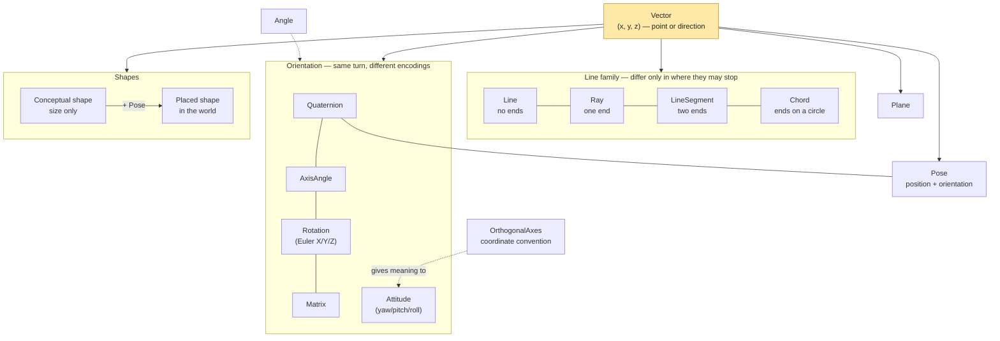

| Type | What it models | How it differs from its neighbours |
|------|----------------|-------------------------------------|
| **`Vector`** | A point or direction in 3D space (x, y, z). | The foundation; almost everything else is built from it. |
| **`Line`** | An infinite straight line. | Infinite in **both** directions — no ends, no length. |
| **`Ray`** | A half-line: a start point and one direction. | Infinite in **one** direction — has a start but no end. |
| **`LineSegment`** | A finite straight line between two points. | **Finite** — two ends, so it has a length and a midpoint. |
| **`Chord`** | A line segment whose ends lie on a circle. | A `LineSegment` that *also* knows its circle's radius, unlocking arc/angle maths. |
| **`Plane`** | An infinite flat surface (`Ax + By + Cz + D = 0`). | A 2D surface in 3D space, with a front and a back. |
| **`Angle`** | An amount of turn. | A 1D quantity with unit conversion and classification (acute, reflex, …). |
| **`Rotation`** | An orientation as Euler angles about X, Y, Z. | Human-friendly to read/write, but prone to gimbal lock. |
| **`Attitude`** | An orientation as yaw / pitch / roll. | The same idea as `Rotation` in aviation naming. |
| **`Quaternion`** | An orientation as a 4-component number. | The robust form: no gimbal lock, smooth interpolation. |
| **`Pose`** | A position **and** an orientation together. | A rigid placement ("where" + "which way") in friendly form. |
| **`Matrix`** | A 4×4 transformation matrix. | The general linear-algebra workhorse for transforms. |
| **`OrthogonalAxes`** | A coordinate-system convention (which way is up, right, far, and its handedness). | A constant label chosen per project — not a position or an orientation. |
| **`Bezier`**, **`Hermite`**, **`CatmullRom`** | Smooth curves through space. | Extend the straight-line/arc interpolation of `Vector` to genuine curves. |
| **`Box`**, **`BoundingSphere`** | Axis-aligned bounding volumes. | Cheap *quick-rejection* hulls — "could these possibly touch?" — distinct from the exact shapes. |
| **`Circle`**, **`Triangle`**, **`Rectangle`**, **`Ellipse`**, **`Annulus`**, **`Sector`** | *Conceptual* flat shapes — size and proportion only, no position. | Pure intrinsic geometry: area, perimeter, angles; comparable by size. |
| **`Sphere`**, **`Cuboid`**, **`Cylinder`**, **`Cone`**, **`Capsule`**, **`Ellipsoid`**, **`Torus`** | *Conceptual* solids — size and proportion only, no position. | Pure intrinsic geometry: volume, surface area; comparable by size. |
| **`Placed…`** (one per conceptual shape) | A conceptual shape **placed** in space by a `Pose`. | Add world-space maths: containment, closest point, line/ray hits. |
| **`PlacedPolygon`**, **`PlacedTetrahedron`** | Vertex-defined shapes (a planar polygon; a solid with four corners). | Always placed — defined by their corners, with no separate conceptual form. |

The shape types come in two layers — a [conceptual shape and its placed partner](#shapes-conceptual-and-placed) — so that size-only maths never has to see a position.

The four members of the **line family** are best understood together — they differ only in *where
they are allowed to stop*:

```
 Line          <──────────●──────────>      infinite both ways · no ends · no length
 Ray                      ●──────────>      starts here · infinite one way · one end
 LineSegment              ●──────────●      finite · two ends · has a length & midpoint
 Chord                    ●─────────╴●╶     a segment whose two ends sit on a circle
                          (              )      ╲___ the circle it belongs to
```

That single difference drives their "closest point" behaviour: a line never clamps (any point on it is
allowed), a ray clamps behind its start, and a segment clamps at both ends.

The three **orientation** types (`Rotation`, `Attitude`, `Quaternion`) all describe the same thing —
which way something is facing — at different trade-offs of readability versus robustness. They convert
freely between one another, and `Pose` bundles an orientation together with a position.

---

## Converting between types

The library converts between types two ways, and the choice of which is deliberate:

- **Cast operators** (`(Target)x`, or implicit) are used only for *value-representation* changes — the
  same value in a different container (`double` ↔ `Angle`, a tuple ↔ a `Vector`), a re-encoding of the
  same rotation, or a lossy *widening* within a family. They never hide a coordinate-convention choice.
- **Named `To*` / `From*` methods** are used for everything else: conversions that do real computation,
  or that need a parameter the language can't supply through a cast — above all anything involving
  yaw/pitch/roll, which always takes an [`OrthogonalAxes`](#orthogonalaxes) so no convention is ever
  assumed silently.

The rule of thumb for the casts themselves: **implicit** when the conversion is total and loses nothing
the type cares about; **explicit** when it narrows precision, decomposes, asserts a precondition, or
discards information (so you write the cast and take responsibility for it).

### Cast operators

| From | To | Implicit / explicit | Why |
|------|----|--------------------|-----|
| `double`, `float`, `int` | `Angle` | implicit | a bare number is treated as radians |
| `Angle` | `double` | implicit | exact (radians) |
| `Angle` | `float`, `int` | **explicit** | narrows precision |
| `(double, double, double)` | `Vector` | implicit | repack |
| `Vector` | `(double, double, double)` | implicit | repack |
| `(double, double, double, double)` | `Quaternion` | implicit | repack |
| `Quaternion` | `(double, double, double, double)` | implicit | repack |
| `(Vector, Angle)` | `AxisAngle` | **explicit** | normalises the axis (not a pure repack) |
| `AxisAngle` | `(Vector, Angle)` | implicit | repack (reads the stored unit axis) |
| `(Vector, Quaternion)` | `Pose` | **explicit** | normalises the orientation (not a pure repack) |
| `Pose` | `(Vector, Quaternion)` | implicit | repack |
| `double` | `ExpandedDouble` | **explicit** | decomposes into sign/exponent/mantissa |
| `Quaternion` ⇄ `AxisAngle` ⇄ `Rotation` ⇄ `Matrix` | (see mesh below) | **explicit** | re-encodes the same rotation |
| `LineSegment` | `Line`, `Ray` | **explicit** | widens — drops the segment's ends |
| `Line` | `Ray` | **explicit** | narrows — keeps only the forward half |
| `Ray` | `Line` | **explicit** | widens — forgets where the ray starts/stops |

### The orientation re-encoding mesh

`Quaternion`, `AxisAngle`, `Rotation` (Euler X/Y/Z) and the rotation `Matrix` are four encodings of the
*same* turn, so every pair interconverts **explicitly** and losslessly (each cast is a thin alias over
the existing `To*`/`From*` method, routing through the quaternion where needed). Casting **from**
`Matrix` additionally asserts its 3×3 block is a pure rotation (scale/skew is ignored).

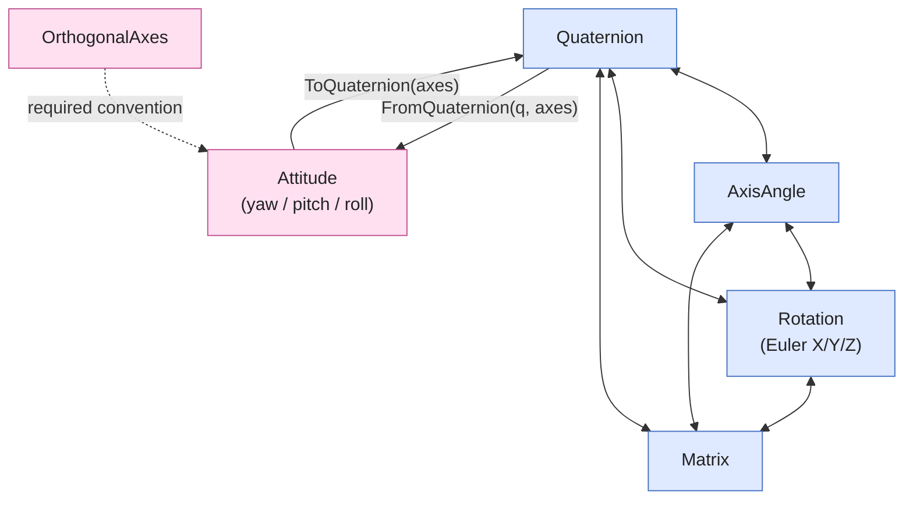

Every solid edge above is a two-way **explicit cast** (e.g. `var aa = (AxisAngle)q;  var m = (Matrix)aa;`).
`Attitude` (yaw/pitch/roll) is **not** in the mesh: it only has meaning relative to an `OrthogonalAxes`,
so it converts through `Attitude.ToQuaternion(axes)` / `Attitude.FromQuaternion(q, axes)` — methods, not
casts. `Pose` is also method/constructor-only for its rotation, because it carries a position too; its
*tuple* cast above is separate — reading a pose out is a lossless repack, but building one in is explicit
because the orientation is normalised.

### Named conversion methods (not casts)

These remain methods on purpose — either because they take a convention, or read more clearly named:

| Conversion | API |
|-----------|-----|
| `Attitude` ⇄ `Quaternion` (convention-aware) | `Attitude.ToQuaternion(axes)` / `Attitude.FromQuaternion(q, axes)` |
| `AxisAngle` ⇄ `Attitude` (convention-aware) | `AxisAngle.FromAttitude(attitude, axes)` |
| `Quaternion` → axis & angle | `Quaternion.ToAxisAngle(out axis, out angle)` |
| `Quaternion` from an axis & angle | `Quaternion.FromAxisAngle(axis, angle)` |
| `Pose` from a position + any orientation type | `new Pose(position, rotation \| attitude+axes \| axisAngle)` |
| `Plane` from geometry | `Plane.FromPointNormal(...)`, `Plane.FromThreePoints(...)` |
| line-family widenings (named form of the casts) | `Line.ToRay()`, `Ray.ToLine()`, `LineSegment.ToLine()` / `ToRay()` |

> Every cast above has a corresponding `To*`/`From*` method behind it, so nothing is *only* reachable
> through an operator — the cast is sugar, the method is the contract.

---

## `Vector` — the foundation

A vector represents values along a number of axes. For this library that is three: three numbers and
three axes. `Vector` is the type everything else leans on, so it gets the fullest treatment.

```csharp
public struct Vector
{
   private double x, y, z;
}
```

**Why a struct rather than a class?** A struct is a value type: it is copied by value, created and
disposed of cheaply, and behaves like a primitive — which is exactly how a vector should feel. (There
is no reason it *could* not be a class; this is a design choice.)

Unless stated otherwise a vector is treated as **positional**, originating at `(0, 0, 0)`. The
alternatives are *unit vectors* (length 1, interpreted as pure direction) and *vector pairs* (where one
vector is the origin and another is the displacement from it).

Throughout, the worked equations assume two vectors broken into components:

$A = \begin{pmatrix} a \\ b \\ c \end{pmatrix}\qquad B = \begin{pmatrix} d \\ e \\ f \end{pmatrix}$

### Accessing the components

The components are exposed as `X`, `Y`, `Z` properties, as an `Array` of three doubles, and through an
indexer (`v[0]`, `v[1]`, `v[2]`). Constructors accept three doubles, an array, or another vector:

```csharp
var v = new Vector(1, 2, 3);
var w = new Vector(new double[] { 1, 2, 3 });
var u = new Vector(v);            // copy
double y = v[1];                  // 2
```

### The basic operators

**Addition** (`v3 = v1 + v2`) — add the components pairwise (x+x, y+y, z+z).

```csharp
public static Vector operator +(Vector v1, Vector v2)
{
   return new Vector(v1.X + v2.X, v1.Y + v2.Y, v1.Z + v2.Z);
}
```

**Subtraction** (`v3 = v1 - v2`) — subtract the components pairwise.

**Negation** (`v2 = -v1`) — invert direction by negating each component. **Reinforcement** (`+v1`)
returns the vector unchanged (it exists only to mirror negation).

**Equality** (`==`, `!=`) — two vectors are equal when all three component pairs are equal. (`Equals`
also offers a tolerance-aware overload, which is what you usually want with floating point.)

**Multiplication and division by a scalar** — scale each component by the number.

```csharp
public static Vector operator *(Vector v1, double s2)
{
   return new Vector(v1.X * s2, v1.Y * s2, v1.Z * s2);
}
```

The order of operands can be reversed (`s1 * v2` does the same thing). Division by a scalar divides
each component.

**Comparison** (`<`, `>`, `<=`, `>=`) — vectors are compared by **magnitude** (length), irrespective of
direction.

### Magnitude

The length, or **magnitude**, of a vector is :

```csharp
public static double Magnitude(Vector v1)
{
   return Math.Sqrt(v1.X * v1.X + v1.Y * v1.Y + v1.Z * v1.Z);
}
```

In the current library this is exposed as a read-only **property**, `v.Magnitude`. To *resize* a vector
to a new length while keeping its direction, use `Scale`:

```csharp
double len = v.Magnitude;             // length of v
Vector resized = v.Scale(2.5);        // same direction, length 2.5
```

When you only need to **compare** lengths, skip the square root with `MagnitudeSquared` (and
`DistanceSquared` for distances) — squaring preserves ordering and is cheaper.

### The two kinds of multiplication: cross and dot

Multiplying vectors is trickier than scaling. There are two products, and neither is overloaded onto an
operator (to avoid confusion) — you call them by name.

The **cross product** of two vectors produces a vector that is normal (perpendicular) to the plane the
two vectors span:


The formula (with v1 = A, v2 = B) expands from  — the sine of the angle accounts for direction, θ being the smallest
angle between A and B ():


In matrix-style notation:


Cross product is **non-commutative**: `v1 × v2` is not the same as `v2 × v1` (they point opposite ways).

```csharp
public static Vector CrossProduct(Vector v1, Vector v2)
{
   return new Vector(
      v1.Y * v2.Z - v1.Z * v2.Y,
      v1.Z * v2.X - v1.X * v2.Z,
      v1.X * v2.Y - v1.Y * v2.X);
}
```

A handy template for working a cross product by hand:


The **dot product** of two vectors is a single scalar, defined by 
and computed as :


```csharp
public static double DotProduct(Vector v1, Vector v2)
{
   return v1.X * v2.X + v1.Y * v2.Y + v1.Z * v2.Z;
}
```

Cosine of the angle is what makes the dot product so useful: it is zero exactly when the vectors are
perpendicular, positive when they point broadly the same way, and negative when they oppose. (The
**mixed**, or scalar triple, product `MixedProduct(v1, v2, v3)` combines both — it is `v1 · (v2 × v3)`
and gives the signed volume of the parallelepiped the three vectors span.)

### Normalisation and unit vectors

A **unit vector** has a magnitude of 1 — a pure direction with the size removed. **Normalisation**
converts any (non-zero) vector to a unit vector by dividing by its magnitude:


```csharp
Vector dir = v.Normalize();           // throws if v has zero length
Vector safe = v.NormalizeOrDefault();  // returns (0,0,0) instead of throwing
```

`IsUnitVector()` tests for length 1 (with a tolerance overload, since exact equality is unreliable for
doubles).

### Interpolation

`Interpolate` takes a point a fraction of the way between two vectors. A `control` of 0 returns the
first vector, 1 returns the second, and 0.5 the midpoint:


$n = n_1(1 - t) + n_2\,t$

```csharp
Vector mid = a.Interpolate(b, 0.5);
```

By default `control` is restricted to ; an overload allows
extrapolation beyond the endpoints.

### Distance

The distance between two positional vectors is Pythagoras' theorem in 3D:


```csharp
double d = a.Distance(b);
```

### Angle between two vectors

```csharp
double radians = a.Angle(b);
```

The angle `θ` between two vectors is always reported in `[0, π]`. Its textbook *definition* is the
arccosine of the normalised dot product:


That definition is correct, but computing it *literally* as `arccos(a·b)` is numerically fragile. So the
library returns the **same angle** by a different — and far steadier — route: **`θ = atan2(a×b length, a·b)`**.
It feeds `atan2` two quantities the vector pair already provides — the dot product, which is large when
the vectors are *aligned*, and the length of the cross product, which is large when they are
*perpendicular*:

| input to `atan2`           | proportional to | large when the vectors are |
|----------------------------|-----------------|----------------------------|
| `a · b` (dot product)      | `cos θ`         | **aligned** (θ near 0 or π) |
| `a × b` length (cross product) | `sin θ`     | **perpendicular** (θ near 90°) |

#### Why these two formulas give the same angle

`atan2(y, x)` returns the angle of the point `(x, y)` measured from the positive *x*-axis. Feed it the
dot product as `x` and the cross-product length as `y`, and that point is `|a||b|·(cos θ, sin θ)` — the
same direction as `(cos θ, sin θ)`, just scaled by the positive number `|a||b|`. Scaling by a positive
number does not change a point's angle, so `atan2` hands back exactly `θ`. And because `sin θ ≥ 0` for
every `θ` in `[0, π]`, that point always sits in the upper half-plane, so the answer lands in `[0, π]`
automatically — the very range we want.

Geometrically — extending the cosine picture above — place `a` along the *x*-axis; the unit vector along
`b` then sits on the unit circle at angle `θ`, with coordinates `(cos θ, sin θ) = (a·b, a×b length)`.
`arccos` is given only the *x*-coordinate, `cos θ`, and must infer the angle from that single number;
`atan2` is given both coordinates and reads the angle directly off the point.

#### Why reading only `cos θ` is fragile

`arccos` must recover the angle from its cosine alone, and the cosine is a poor messenger near the ends
of the range. The slope of `arccos` is `−1 / √(1 − (a·b)²)`, which grows without bound as `a·b → ±1` —
exactly where the vectors are nearly parallel or nearly anti-parallel. So a microscopic rounding error
in `a·b` is magnified into a large error in `θ`, and if rounding pushes `a·b` just past `−1`, `arccos`
returns `NaN` outright. The table traces that blow-up (for two near-anti-parallel unit vectors the
rounded dot product is only about `1` ULP from `−1`):

| `a · b` (cos θ) | θ | sensitivity `dθ/d(a·b) = −1/√(1−(a·b)²)` |
|-----------------|-----|------------------------------------------|
| `0` (perpendicular) | `90°`  | `−1.0` — gentle, harmless |
| `−0.9`              | `154°` | `−2.3` |
| `−0.99`             | `172°` | `−7.1` |
| `−0.9999`           | `179°` | `−70.7` |
| `−1 + 1e-16` (anti-parallel) | `≈180°` | `≈ −7×10⁷` — catastrophic |
| `−1.0000000000000002` (rounded *past* −1) | — | `NaN` |

This is the exact mechanism behind the old `Vector.Angle` bug: `arccos(a·b)` returned `NaN` for a vector
and its own negation, because the rounded dot landed a hair below `−1`.

#### Why reading both coordinates is steady

`atan2` avoids this because near the poles it leans on the coordinate that is still *responsive*. Write
`θ = π − φ` for a small `φ`: the cosine `cos θ = −cos φ ≈ −1 + φ²/2` flattens out — it changes only with
`φ²`, so it loses precision — while the sine `sin θ = sin φ ≈ φ` keeps changing linearly and carries the
information. Exactly where the dot product goes numb, the cross length is at its most informative, and
`atan2`, seeing both, is governed by the responsive one. The same holds at `θ = 0`. The result is
well-conditioned across the whole range, needs no clamping, and returns *exactly* `π` for a vector and
its negation (`atan2(0, −1) = π`).

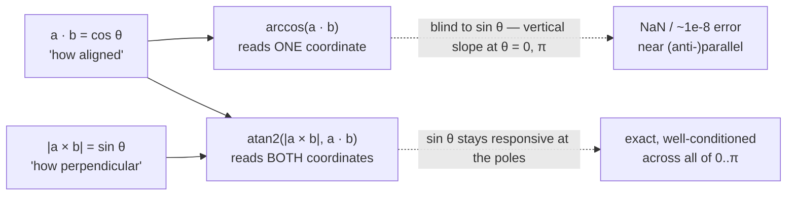

(The implementation normalises both vectors first only so its existing special-case handling for zero,
infinite and `NaN` components still governs the result; the `atan2` identity itself needs no
normalisation, since it depends only on the *ratio* of the cross length to the dot.)

### Rotation: yaw, pitch and roll

`Yaw`, `Pitch` and `Roll` rotate a vector about a coordinate convention's **Up**, **Right** and
**Forward** axes — *not* a hard-wired X/Y/Z. "Yaw" only means something once you have decided which way
is up, so each overload takes an [`OrthogonalAxes`](#orthogonalaxes) convention, and the sense of a
positive angle follows that convention's handedness:

```csharp
Vector yawed   = v.Yaw(angle, OrthogonalAxes.DirectX);     // about axes.Up
Vector pitched = v.Pitch(angle, OrthogonalAxes.DirectX);   // about axes.Right
Vector rolled  = v.Roll(angle, OrthogonalAxes.DirectX);    // about axes.Forward
```

The pictures below show the **DirectX** convention, where Up / Right / Forward are +Y / +X / +Z.

**Yaw** — about the convention's **Up** (here +Y):


**Pitch** — about the convention's **Right** (here +X):


**Roll** — about the convention's **Forward** (here +Z):


Each delegates to the library's single right-hand-rule primitive (`Quaternion.FromAxisAngle`), so no
axis assumption is baked in — switch the convention and the rotations follow it (a `Roll` banks the
opposite way in a left- vs right-handed frame). When you want to name the *literal* axis instead, use
`RotateX` / `RotateY` / `RotateZ` (with optional offset pivots and `Angle`-typed overloads). For
robust, composable orientation prefer [`Quaternion`](#orientation-rotation-attitude-quaternion).

This is exactly where the convention-aware design earns its keep. The literal `RotateZ` always banks
about **+Z**; `Roll` banks about the frame's *own* **Forward**. So the two agree precisely when a
frame's forward **is** +Z (DirectX, Unity) and correctly turn *opposite* ways when it is −Z (OpenGL,
Maya, Godot, where +Z carries *near*):

| Frame | `axes.Forward` | `Roll(θ)` equals |
|-------|----------------|------------------|
| DirectX / Unity (z = far) | `(0, 0, +1)` | `RotateZ(θ)` |
| OpenGL / Maya / Godot / MathsYUp (z = near) | `(0, 0, −1)` | `RotateZ(−θ)` |

`Roll` is the *honest* one: it surfaces an assumption the fixed-axis primitive silently bakes in
(banking about +Z even in frames whose forward is −Z). The relationship is pinned as a positive test,
`Roll_HonoursEachFramesForward_RelatingToLiteralRotateZ`.

### Projection, rejection and reflection

- **`Projection(direction)`** — the "shadow" of a vector cast along another vector's line: the part of
  it that lies *along* `direction`.
- **`Rejection(direction)`** — what is left over: the part *perpendicular* to `direction` (so that
  projection + rejection reconstructs the original).
- **`Reflection(reflector)`** — mirror the vector about the **line** of another vector.
- **`Reflect(normal)`** — mirror the vector about the **surface** described by a normal: the classic
  "bounce", where the angle of incidence equals the angle of reflection. *(Note the distinction:
  `Reflection` mirrors about a line, `Reflect` about a surface.)*


```csharp
var incoming = new Vector(1, -1, 0);
var surfaceNormal = new Vector(0, 1, 0);
var bounced = incoming.Reflect(surfaceNormal);   // (1, 1, 0)
```

### Other useful operations

**Back-face test.** Interpreting a vector as a face normal, `IsBackFace(lineOfSight)` reports whether
the face points away from the viewer (a negative dot product with the line of sight):


**Perpendicularity.** `IsPerpendicular(other)` is true when the dot product is zero (with a tolerance
overload).

**Component utilities.** `SumComponents`, `SumComponentSqrs`, `PowComponents`, `SqrtComponents`,
`SqrComponents`, `AbsComponents`, and `Round` (with digit/`MidpointRounding` overloads) apply arithmetic
to each component independently. (Note that `Abs` is *not* one of these: it returns the vector's
**magnitude** `|v|` — the scalar norm, the way `Math.Abs` gives the size of a number — so it is an alias
for `Magnitude`. Use `AbsComponents` for the per-axis `(|x|, |y|, |z|)`.)

### Operations added for modern, everyday use

Beyond the original article, `Vector` has grown a handful of operations that round it out. Each is also
available to explore in the interactive [visualizer](RP.Math.Visualizer) — drag the vectors and watch
the result update live.

**Slerp — spherical interpolation.** Where `Interpolate` (linear) walks the straight **chord** between
two vectors, `Slerp` walks the **arc** at constant angular speed, keeping interpolated directions on
the sphere. It falls back to linear interpolation when the vectors are (anti)parallel.


```csharp
var halfway = Vector.XAxis.Slerp(Vector.YAxis, 0.5);   // ~ (0.707, 0.707, 0), still length 1
```

**ClampMagnitude.** Caps a vector's length at a maximum while keeping its direction (a no-op when it is
already short enough) — handy for limiting speeds and forces.


```csharp
var limited = new Vector(3, 4, 0).ClampMagnitude(2.5);   // (1.5, 2, 0), length 2.5
```

**MoveTowards.** Steps from one point towards a target by at most a given distance, never overshooting
— the staple of frame-by-frame animation and AI movement.


```csharp
var next = Vector.Origin.MoveTowards(new Vector(10, 0, 0), 3);   // (3, 0, 0)
```

**Component-wise `ComponentMin`, `ComponentMax` and `Clamp`.** These work on **each axis
independently** — the X of the result depends only on the Xs of the inputs, and so on. Together
`ComponentMin`/`ComponentMax` give the two opposite corners of the axis-aligned box that just contains
the inputs:


```csharp
var lo = new Vector(1, 5, 3).ComponentMin(new Vector(4, 2, 6)); // (1, 2, 3)
var hi = new Vector(1, 5, 3).ComponentMax(new Vector(4, 2, 6)); // (4, 5, 6)
```

> **Not the same as `Min` / `Max`.** Those compare whole vectors by *magnitude* and return the shorter
> or longer one unchanged — they never mix components. Use the `Component…` versions for a per-axis
> result.

`Clamp` applies the same idea to a range, pushing each component into the `[min, max]` interval for its
axis:


```csharp
var inBox = new Vector(5, -5, 2).Clamp(Vector.Origin, new Vector(3, 3, 3)); // (3, 0, 2)
```

**Zero test, deconstruction and tuple conversion.**

```csharp
bool isZero   = v.IsZero();          // exactly (0, 0, 0)
bool nearZero = v.IsZero(1e-6);      // within a tolerance of zero
var (x, y, z) = v;                   // deconstruction
Vector p = (1.0, 2.0, 3.0);          // implicit from a tuple
```

### Standard constants

```csharp
Vector.Origin    // (0, 0, 0)   also Vector.Zero
Vector.XAxis     // (1, 0, 0)
Vector.YAxis     // (0, 1, 0)
Vector.ZAxis     // (0, 0, 1)
Vector.MinValue, Vector.MaxValue, Vector.Epsilon, Vector.NaN
```

`Vector` also implements `IComparable` (by magnitude), `Equals`/`GetHashCode` (with tolerance-aware
overloads), `IsNaN`, and `ToString` / `ToVerbString` for textual output.

---

## The line family: `Line`, `Ray`, `LineSegment`, `Chord`

All four describe a straight path through space. As the [overview](#the-types-at-a-glance) showed, they
differ only in *where they are allowed to stop* — and that single fact explains every difference in
their behaviour. They are immutable and built on `Vector`.

### `Line` — infinite in both directions

A line is the "no ends" member: it stretches forever both ways, so it has **no length and no
midpoint**. It is stored as a `Point` it passes through plus a unit `Direction` it runs along. Every
point on it is

```
P(t) = Point + t · Direction      for any t, positive or negative
```

Because `Direction` is unit length, `t` is a true distance. Construct one from a point and a direction,
or through two points:

```csharp
var line = new Line(new Vector(0, 0, 0), new Vector(1, 1, 0));
var same = Line.ThroughPoints(new Vector(0, 0, 0), new Vector(2, 2, 0));
```

**Closest point.** To find the point on the line nearest some `point`, project onto the direction. The
signed distance along the line is `t = (point − Point) · Direction` (no division, since `Direction` is
unit length), and the nearest point is `Point + t · Direction`. Crucially, `t` is **never clamped** —
the whole endless line is available, so the perpendicular foot is always reachable.

```csharp
Vector foot = line.ClosestPointTo(p);
double dist = line.DistanceTo(p);          // length of the perpendicular
bool on     = line.Contains(p, 1e-9);
```

**Parallelism.** Two lines are parallel when their directions point the same or exactly opposite ways.
Since `|a × b| = |a||b|sinθ` and our directions are unit length, the cross-product magnitude is just
`sinθ`, which is zero precisely at 0° or 180°:

```csharp
bool parallel = line.IsParallelTo(other, 1e-9);   // |Direction × other.Direction| ≤ tolerance
```

### `Ray` — infinite in one direction

A ray is the "one end" member — think of a beam of light or a line of sight. It has an `Origin` and a
unit `Direction`, and every point on it is

```
P(s) = Origin + s · Direction      for s ≥ 0
```

Negative `s` would be *behind* the start, which is not part of the ray. So `PointAt` clamps a negative
distance to the origin, and `ClosestPointTo` returns the origin whenever the projection falls behind
it. That is the only behavioural difference from `Line`:

```csharp
var ray = new Ray(new Vector(0, 0, 0), new Vector(1, 0, 0));
Vector hit = ray.ClosestPointTo(new Vector(-5, 2, 0));   // the origin — the point is behind the start
double d   = ray.DistanceTo(new Vector(3, 4, 0));
```

### `LineSegment` — finite, with two ends

A segment runs between a fixed `Tail` (start) and `Head` (end). Having two ends gives it things the
others lack: a `Length`, a `Midpoint`, and a `Direction`. Every point on it is written with a parameter
that runs from 0 to 1:

```
P(t) = Tail + t · (Head − Tail)      with t clamped to 0..1
```

```csharp
var seg = new LineSegment(new Vector(0, 0, 0), new Vector(3, 4, 0));
double len = seg.Length;             // 5  = |Head − Tail|
Vector mid = seg.Midpoint;           // (1.5, 2, 0) = (Tail + Head) / 2
Vector q   = seg.PointAt(0.25);      // a quarter of the way along
```

**Closest point.** Project onto the segment's direction `d = Head − Tail`. Minimising the squared
distance `|Tail + t·d − point|²` gives

```
t = ((point − Tail) · d) / (d · d)
```

then `t` is **clamped to 0..1** so the answer can never fall beyond an end, and `P(t)` is evaluated. (A
zero-length segment returns its tail.) This clamping at *both* ends is what distinguishes a segment
from a ray (one end) and a line (no ends).

**Other operations.** A segment can hand you the infinite [`Line`](#line--infinite-in-both-directions)
it lies on (`ToLine()`, useful when you want to ignore the ends), produce a `Reversed()` copy,
`Translate(offset)` to slide it, rotate its head about its tail (`RotateX/Y/Z(angle)`), and
`Interpolate(control)` along its length. It can be built from two points, six numbers, or an array of
six.

### `Chord` — a segment that knows its circle

A chord is a `LineSegment` whose two ends both lie on a circle — and which *also* knows that circle's
`Radius`. On its own a chord is just a segment; the radius is the whole reason the type exists,
because a surprising amount of circle geometry follows from the chord's length `c` and the radius `r`
alone. All of it comes from one right-angled triangle: drop a perpendicular from the circle's centre
to the chord; it meets the chord at its midpoint, with the radius `r` as the hypotenuse and the
half-chord `c/2` as one leg.

```csharp
var chord = new Chord(new Vector(-3, 0, 0), new Vector(3, 0, 0), radius: 5);
```

| Property | Meaning | Formula |
|----------|---------|---------|
| `CentralAngle` | The angle the chord subtends at the centre | `θ = 2·asin((c/2)/r)` |
| `ArcLength` | The curved distance along the edge between the ends | `r · θ` |
| `DistanceFromCentre` | Straight distance from centre to chord (the apothem) | `√(r² − (c/2)²)` |
| `Sagitta` | How far the arc bulges past the chord (its height) | `r − DistanceFromCentre` |
| `Diameter` | The longest possible chord | `2r` |

Each derivation is spelled out in the source. For example `sin(θ/2) = (c/2)/r` gives the central angle;
Pythagoras on the same triangle gives the centre-to-chord distance; and the sagitta is simply what is
left of the radius once you subtract that distance. (Ratios are clamped and roots guarded so a
full-diameter chord resolves to a clean 180° rather than a non-number. "Sagitta" is Latin for *arrow* —
the chord is the bow, the height is the drawn arrow.)

---

## `Plane`

A plane is an infinite flat surface, stored in the standard algebraic form

```
A·x + B·y + C·z + D = 0
```

where `(A, B, C)` is the plane's `Normal` (the direction it faces) and `D` is a signed offset. It is an
immutable value type following the `Vector` design.

**Building a plane.** The raw constructor stores whatever coefficients you give it; the geometry
factories produce a unit normal for you:

```csharp
var p1 = Plane.FromPointNormal(point, normal);     // a point on it + which way it faces
var p2 = Plane.FromThreePoints(a, b, c);           // through three points (throws if collinear)
var xy = Plane.XY;                                  // z = 0; also Plane.XZ, Plane.YZ
```

`FromThreePoints` builds the normal with the cross product `(b − a) × (c − a)` following the right-hand
rule for the order a → b → c, and throws if the points are collinear (they do not define a unique
plane).

**Signed distance and sides.** The key operation is the **signed** distance from a point to the plane:
positive on the side the normal points to, negative on the far side, zero on the plane itself. From it
everything else follows:

```csharp
double s   = plane.SignedDistanceTo(point);   // sign tells you which side
double d   = plane.DistanceTo(point);         // unsigned
int    side = plane.SideOf(point, 1e-9);      // +1, -1 or 0 (on the plane)
bool   on   = plane.Contains(point, 1e-9);
Vector foot = plane.ClosestPoint(point);      // orthogonal projection onto the plane
Vector mir  = plane.Reflect(point);           // mirror the point through the plane
```

**Line intersection.** `TryIntersectLine` returns where a line crosses the plane, reporting `false`
when the line is parallel (no single crossing). `IntersectLineParameter` returns just the parameter
`t` along the line, or `NaN` if parallel:

```csharp
if (plane.TryIntersectLine(linePoint, lineDirection, out Vector where)) { /* … */ }
```

**Plane intersection.** Two planes that are not parallel always meet in an infinite [`Line`](#the-line-family-line-ray-linesegment-chord).
`TryIntersect(other, out Line line)` returns it, reporting `false` when the planes are parallel (whether
disjoint or coincident — neither gives a single line). The line's direction is the cross product of the
two normals (`n₁ × n₂`); a point on it is found by solving the small 2×2 system that forces a blend of
the two normals to satisfy both plane equations:

```csharp
if (Plane.XY.TryIntersect(Plane.XZ, out Line axis)) { /* axis is the X axis */ }
```

**Comparing planes.** `==` is an exact component-wise comparison of the four coefficients, but two
planes can describe the *same surface* with differently scaled (or flipped) coefficients —
`Equals(other, tolerance)` checks for that by comparing both in normalized form (and negated). Other
helpers: `Normalize()` (unit normal, same surface), unary `-` (flip orientation), `IsDegenerate()`
(zero normal), `IsParallelTo(other, tolerance)`, and deconstruction into `(A, B, C, D)`.

---

## `Angle`

`Angle` is an immutable value type for *an amount of turn*. It stores radians internally but lets you
read and write degrees, radians or gradians, so a bare `double` never leaves you guessing about units.
A positive value is taken clockwise, a negative value counter-clockwise, and angles beyond a full
circle are automatically reduced.

```csharp
var a = new Angle(System.Math.PI / 2);       // radians
var b = new Angle(90, AngleUnits.DEG);        // degrees
double deg = a.Deg;   // 90
double rad = a.Rad;   // π/2
Angle implicitlyRadians = 1.5;                // double → Angle (radians)
```

**Arithmetic and comparison.** The usual operators are overloaded (`+`, `-`, `*`, `/`, unary `-`, and
the comparison operators). Unary `-` is a true negation — `-a` flips the sign of the value, so
`a + (-a) == 0`. To re-express the *same* physical turn measured the other way round the circle, use
the clearly-named `CounterClockwise()`/`Clockwise()` methods (or the `!` operator, which toggles between
the two windings). Equality is tolerance-aware via a shared static `Tolerance`.

**Classification.** `Angle` can tell you what *kind* of angle it is — `IsAcute`, `IsRightAngle`,
`IsObtuse`, `IsStraitAngle`, `IsReflex`, `IsFullOrZeroAngle`, `IsOblique`, `IsClockwise` — and how two
angles relate: `IsComplementOf` (sum to 90°), `IsSupplementOf` (180°), `IsExplementOf` (360°). It also
offers `Complement`, `Supplement`, `SmallAngle`, `Reflex`, `Abs`, and clockwise/counter-clockwise
conversions.

**Trigonometry.** Static and instance `Sin`, `Cos`, `Tan` (and their hyperbolic forms), plus the
inverse builders `Asin`, `Acos`, `Atan` that *return* an `Angle`.

**Constants.** `Angle.Right_Angle`, `Angle.Strait_Angle`, `Angle.Full_Angle`,
`Angle.Three_Quater_Circle`, `Angle.Zero_Angle`, and the matching `…_Rad` radian literals.

The companion `AngleUnits` enum names the three unit systems (`DEG`/`DEGREE`, `RAD`/`RADIAN`,
`GRAD`/`GRADIENT`). The `ToString` formats support `d` (degrees), `r` (radians), `g` (gradians) and `v`
(a verbose description that names the kind of angle).

---

## Orientation: `Rotation`, `Attitude`, `Quaternion`

These three types all answer the same question — *which way is something facing?* — but trade
readability against robustness. They convert freely between one another, so you can author in the
friendly form and store in the robust one.

### `Rotation` — Euler angles (X, Y, Z)

The human-friendly "front door": three `Angle`s applied about the X, then Y, then Z world axes
(equivalently the matrix product `Rz · Ry · Rx`).

```csharp
var r = new Rotation(pitch, yaw, roll);          // angles about X, Y, Z
var rx = Rotation.AboutX(angle);                 // single-axis factories: AboutX/Y/Z
Vector turned = r.Rotate(v);
```

Component arithmetic (`+`, `-`) acts **component-wise on the angles** — useful for nudging a rotation,
but *not* the same as composing two rotations. For true composition, convert to a `Quaternion` and
multiply. `ToQuaternion` / `FromQuaternion` bridge the two exactly (folding X into Z at the
gimbal-lock poles), and `Inverse()` and `ToMatrix()` round it out. `Rotation` names the *literal* X/Y/Z
axes, so it needs no convention.

### `Attitude` — yaw / pitch / roll

Aviation naming for an orientation: yaw (heading), pitch (elevation) and roll (bank). Those words only
become concrete once a convention says which way is up, right and forward, so an `Attitude` turns into
a rotation **only** when you hand it an [`OrthogonalAxes`](#orthogonalaxes) — there is deliberately no
axis-free conversion. Yaw is about `axes.Up`, pitch about `axes.Right`, roll about `axes.Forward`, and
the result follows that convention's handedness.

```csharp
var att = new Attitude(yaw, pitch, roll);
var y   = Attitude.FromYaw(angle);                       // FromYaw / FromPitch / FromRoll
Quaternion q = att.ToQuaternion(OrthogonalAxes.OpenGL);  // yaw/pitch/roll → rotation, in a convention
Vector v2 = att.Rotate(v, OrthogonalAxes.OpenGL);
Attitude back = Attitude.FromQuaternion(q, OrthogonalAxes.OpenGL);   // and the convention-aware read-back
```

### `Quaternion` — the robust form

A quaternion `(x, y, z, w)` is a four-component number used to represent rotations **without** the
gimbal-lock and interpolation problems of Euler angles. The scalar (real) part is `W`; the vector
(imaginary) part is `(X, Y, Z)`. Multiplication uses the Hamilton convention. It follows the `Vector`
design — static and instance forms, strict and `…OrDefault` normalisation, tolerance-aware equality.

```csharp
var q = Quaternion.FromAxisAngle(axis, angle);   // a turn about an axis
Vector rotated = q.Rotate(v);
q.ToAxisAngle(out Vector ax, out Angle ang);
```

Why it is the dependable representation:

- **No gimbal lock** — it never loses a degree of freedom the way three stacked Euler angles can.
- **Composes cleanly** — multiplying two quaternions composes their rotations (`q1 * q2`).
- **Interpolates smoothly** — `Slerp` walks the shortest arc at constant angular speed (with `Lerp`
  as the cheaper straight-line approximation).

It also offers `Conjugate`/`Inverse`, `DotProduct`, `AngleBetween`/`AngleTo`, `FromYawPitchRoll(…, OrthogonalAxes)`,
`ToMatrix`, the identity/zero/NaN constants, and predicates `IsUnit`, `IsIdentity`, `IsZero`, `IsNaN`.

**Building an orientation that points somewhere.** Two factories construct a rotation from directions
rather than from angles:

- **`FromToRotation(from, to)`** — the shortest-arc turn that swings the direction `from` onto the
  direction `to`. The axis is their cross product, the angle comes from their dot product; the aligned and
  exactly-opposite cases are handled. (This is the primitive `PlacedTriangle.FromVertices` now leans on.)
- **`LookRotation(forward, up, axes)`** — the orientation that "looks" along `forward` with `up` as the
  upward reference. Like `FromYawPitchRoll`, it takes an [`OrthogonalAxes`](#orthogonalaxes) so it never
  assumes a fixed frame: it maps the convention's `Forward` onto `forward` and its `Up` as near to `up` as
  the look direction allows (a single-argument overload uses the convention's own `Up`). The third axis
  then follows with the convention's handedness, so there is no handedness branching to get wrong.

```csharp
Quaternion turn = Quaternion.FromToRotation(Vector.XAxis, Vector.YAxis);   // a quarter turn about +Z
Quaternion look = Quaternion.LookRotation(target - eye, OrthogonalAxes.OpenGL);
```

(Both are static factories on `Quaternion`; for the Euler form just cast the result, `(Rotation)look`.)

---

## `Pose`

A `Pose` is a rigid placement in space — a **position together with an orientation** ("where" *and*
"which way"). It is the human-meaningful form of a rigid transform, as opposed to a 4×4
[`Matrix`](#matrix). Internally the orientation is kept as a unit `Quaternion` (the robust
representation), but you can construct it from a friendlier `Rotation` (or an `Attitude` plus a
convention) and read it back as Euler angles.

```csharp
var pose = new Pose(position, rotation);          // also a Rotation, or an Attitude + an OrthogonalAxes
var at   = Pose.At(position);                      // no rotation
var fa   = Pose.FromAxisAngle(position, axis, angle);
```

**Applying a pose** transforms between the pose's local space and world space:

```csharp
Vector world  = pose.Apply(localPoint);           // rotate, then translate
Vector dirW   = pose.ApplyDirection(localDir);    // rotate only (directions ignore position)
Vector local  = pose.ApplyInverse(worldPoint);    // the inverse transform
Matrix m      = pose.ToMatrix();                   // the equivalent 4×4 transform
```

**Composition.** `Compose` (and the `*` operator) chains two poses — `outer * inner` applies `inner`
first, then `outer` — and `Inverse()` undoes a pose. Modifier methods return a new pose:
`Translate(offset)`, `RotateBy(delta)`, `WithPosition(p)`, `WithRotation(q)`. The `RotationAsEuler`
helper reads the orientation back as Euler X/Y/Z angles (for yaw/pitch/roll, use
`Attitude.FromQuaternion(pose.Rotation, axes)` with your convention), and `Pose.Identity` is the pose
at the origin with no rotation.

---

## `Matrix`

`Matrix` is the general-purpose 4×4 transformation matrix — the linear-algebra workhorse behind
translation, scaling and rotation, and the form that composes all of them by multiplication. Whereas
`Pose` is the *readable* form of a rigid transform, `Matrix` is the *general* form (it can also scale
and shear).

It can be built from a 3×3 or 4×4 array (smaller inputs are promoted to homogeneous 4×4 form), from
sixteen explicit values, from a `Vector`, or copied. It supports the arithmetic operators (`+`, `-`,
scalar `*` and `/`, matrix `*`, and matrix–vector `*` to transform a vector), `Transpose()`,
`IsIdentity` / `IsZero`, tolerance-aware equality and formatting, and the `Identity` / `Zero`
constants.

Factory builders create the standard transforms:

```csharp
var t = Matrix.TranslationMatrix(new Vector(1, 2, 3));
var s = Matrix.ScalingMatrix(2, 2, 2);
var rx = Matrix.RotationMatrixAboutXAxis(angle);   // …AboutYAxis, …AboutZAxis
Vector moved = t * v;                               // apply the transform to a vector
```

**Determinant and inverse.** The `Determinant` measures how the transform scales volume (and its sign
records whether the transform flips orientation); it is zero exactly when the transform *collapses* space
onto a plane, line or point. `Inverse()` returns the transform that **undoes** this one — so
`m * m.Inverse()` is the `Identity` — computed the textbook way, as the adjugate (the transpose of the
matrix of cofactors) divided by the determinant. That division is why a collapsing transform has no
inverse: information flattened away cannot be recovered. `Inverse()` throws on a singular matrix;
`IsInvertible` lets you check first.

```csharp
Matrix world  = Matrix.TranslationMatrix(pos) * Matrix.ScalingMatrix(2, 2, 2);
Vector local  = world.Inverse() * worldPoint;     // map a world point back into local space
bool ok       = world.IsInvertible;                // false only when the determinant is zero
```

**View and projection.** `Matrix` also builds the **camera** matrices — `LookAt`, `PerspectiveFieldOfView`,
`Orthographic` — that turn a 3D scene into a flat picture, together with `Transform` (the perspective
divide). These have their own illustrated walk-through in
[The camera: view and projection matrices](#the-camera-view-and-projection-matrices) below.

---

## The camera: view and projection matrices

Everything so far has lived in **world space** — a fixed 3D stage where points, shapes and cameras all have
coordinates. But a screen is **flat**. To draw the world you must answer one question: *if I stand here,
look that way, and hold a rectangular frame up to the scene, where does each 3D point land on that 2D
frame?* Answering it is the one place this library brushes against **rendering** — and because the maths is
such a clean, classic piece of geometry, it is worth walking through slowly. (Turning the final coordinates
into coloured pixels is your graphics API's job, not this library's.)

The journey from an object to the screen is a short assembly line, and most steps are **one matrix multiply**:

```mermaid
graph LR
    M["Model space<br/>(an object's own coordinates)"] -->|"model matrix"| W["World space<br/>(placed in the scene)"]
    W -->|"view (LookAt)"| V["View space<br/>(camera at the origin, looking down −Z)"]
    V -->|"projection"| C["Clip space<br/>(homogeneous — carries a w)"]
    C -->|"÷ w  (Transform)"| N["Device coordinates<br/>(inside the −1…+1 clip cube)"]
    N -->|"viewport — your graphics API"| S["Screen pixels"]
    classDef lib fill:#dfe9ff,stroke:#4472c4,color:#222;
    classDef ext fill:#eeeeee,stroke:#999999,color:#555555;
    class V,C,N lib;
    class M,W,S ext;
```

The blue steps — the view matrix, the projection, and the divide that follows — are what `Matrix` builds for
you. The grey ends (placing each object in the world, and stretching the final cube across your window's
pixels) belong to your application.

### A convention, stated out loud

View and projection are the corner of graphics where two perfectly sensible textbooks disagree — which way
the camera looks, whether the depth runs 0→1 or −1→+1, whether the frame is left- or right-handed. There is
no neutral answer, so rather than hide a choice, this library makes one and says it plainly. It is the same
**right-handed, OpenGL convention** the rest of the documentation's pictures assume:

> The camera sits at the origin of view space and looks down its own **−Z** axis, with **+X** to the right
> and **+Y** up. Each projection squashes the visible region into a **clip cube** running from **−1 to +1**
> on every axis — the near plane landing at z = −1 and the far plane at z = +1.

(This is deliberately *not* expressed through [`OrthogonalAxes`](#orthogonalaxes): that type names the roles
of the **world** axes, whereas these conventions are about **clip space** — a different thing. If you target
a left-handed API, or one whose clip depth runs 0→1, these builders are the wrong tool, and the maths below
shows exactly what would change.)

### Step 1 — the view matrix: moving the world in front of the camera

Here is the trick that makes cameras simple: **you never move the camera.** Instead you move the *entire
world* so that the camera ends up at the origin, looking in a fixed direction. A photograph of a mountain,
and a photograph taken by swinging the whole mountain in front of a bolted-down lens, are identical — so we
choose the version that puts the camera somewhere predictable. The matrix that does this rearranging is the
**view matrix**, and `LookAt` builds it from three friendly inputs:

- **`eye`** — where the camera is, in world space.
- **`target`** — a point it is aimed at.
- **`up`** — roughly which way is "up" for the camera. It need not be exactly perpendicular to the gaze; it
  is only a hint, used to decide how the camera is rolled.

From those it constructs an **orthonormal basis** — three mutually perpendicular unit axes — for the camera:

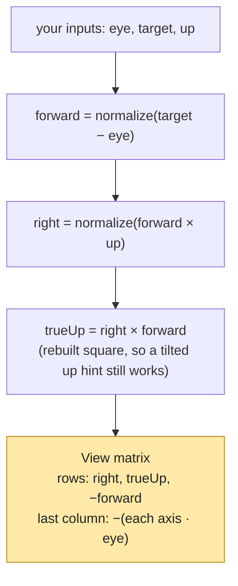

The `forward × up` cross product gives a vector perpendicular to both (the camera's `right`); a second cross
product rebuilds a clean `up` exactly square to the other two — which is why a hastily-chosen up hint still
yields a valid frame. Those three axes become the **rows** of the rotation part (they re-express any world
direction in camera axes), and the last column shifts the eye to the origin. Because a right-handed camera
looks down −Z, the forward axis goes in negated.

```csharp
Matrix view = Matrix.LookAt(eye: new Vector(0, 0, 5), target: Vector.Origin, up: Vector.YAxis);
view.Transform(new Vector(0, 0, 5));   // the eye    -> (0, 0,  0): the camera is now at the origin
view.Transform(Vector.Origin);          // the target -> (0, 0, -5): dead ahead, down -Z
```

`LookAt` refuses two impossible requests — an `eye` equal to the `target` (no direction to look in), and an
`up` hint parallel to the gaze (no way to tell which way is up) — throwing rather than returning a broken
matrix.

### Step 2 — the projection: choosing the shape of "visible"

The view matrix leaves the camera at the origin looking down −Z, but the world is still fully 3D and
unbounded. A **projection matrix** does two jobs at once: it picks the region of space that is actually
visible (the **view volume**) and squashes that region onto the standard clip cube. There are two shapes of
view volume, and they give the two familiar looks.

**Perspective** — the view volume is a **frustum**: a pyramid with its tip at the eye and its top sliced
off. Something further away fills a smaller slice of your vision, so it looks smaller — the everyday look of
eyes and cameras, where parallel railway lines appear to meet at the horizon.

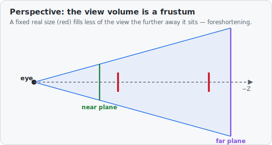

`PerspectiveFieldOfView(verticalFov, aspect, near, far)` is the everyday builder: give it how much it sees
top-to-bottom (the vertical **field of view** angle), the **aspect** ratio width ÷ height of your window, and
the **near**/**far** distances that cap the frustum at each end. (The general
`PerspectiveOffCenter(left, right, bottom, top, near, far)` — the `glFrustum` form — allows a lopsided
frustum, for stereo or tiled rendering; the field-of-view version is just its symmetric case.)

**Orthographic** — the view volume is a plain **box**. With no tip, depth no longer changes size: a
metre-wide object draws the same whether it is near or far. This is the look of engineering drawings, maps,
and most 2D and isometric games.

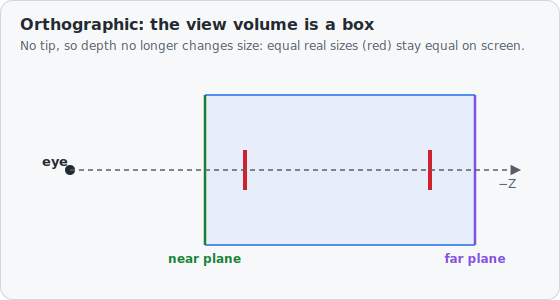

`Orthographic(width, height, near, far)` builds a box centred on the gaze; `OrthographicOffCenter(left,
right, bottom, top, near, far)` (the `glOrtho` form) places it freely.

### The clever bit — homogeneous *w* and the perspective divide

How can a single matrix multiply make distant things smaller? Plain matrix multiplication is **linear** — it
can rotate, scale, shear, and (with the 4×4 trick) translate, but it cannot *divide*, and shrinking-with-depth
is a division: an object at twice the distance should appear half as big. The way out is the fourth
coordinate, **w** — the "homogeneous" coordinate that has quietly ridden along in every 4-vector.

An ordinary point carries `w = 1`. A perspective matrix is built so that, instead of leaving `w` alone, it
copies the point's **depth** into `w`. After the multiply you therefore hold `(x′, y′, z′, w′)` where `w′` is
(near enough) *how far away the point was*. One final step — dividing all of them by `w′`, the **perspective
divide** — turns that stored depth into real shrinkage:

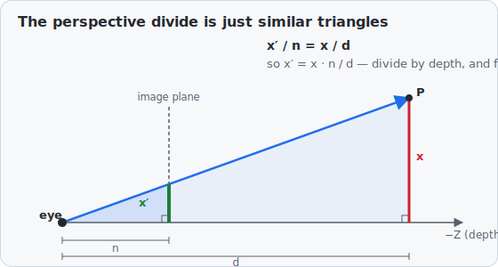

That last line is just **similar triangles** — the same ratio you met at school — and it is the whole secret
of perspective: divide the across-screen position `x` by the depth `d`, and distant points (large `d`) are
pulled in toward the centre. The matrix does the multiply; the divide finishes the job.

This is why the projection matrices need their own apply method. The `*` operator **refuses** any result
whose `w` is not 1 — it is meant for *affine* transforms, the moves that keep `w = 1` (translation, rotation,
scaling, and the view matrix) — so it would throw on a perspective result. Use **`Transform(v)`** instead: it
does the multiply *and* the perspective divide. For an affine matrix `w′` is already 1, so `Transform` and
`*` agree — meaning you can reach for `Transform` whenever a projection might be involved and never be caught
out.

### The clip cube — what comes out

After the divide, every visible point lands inside the **clip cube**: x, y and z each between −1 and +1.

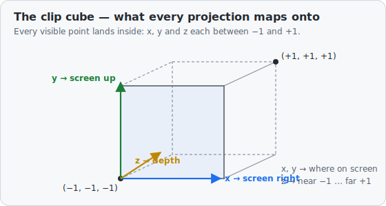

The x and y say where on the screen the point belongs; the z carries depth, so a renderer can tell which
surface is in front when two land on the same pixel. Stretching this −1…+1 cube across your actual window in
pixels — the *viewport* transform — is the final step, and the point at which this library hands over to your
graphics API.

### Putting it together

The matrices compose by multiplication, right-to-left in the order a point travels — **model**, then
**view**, then **projection** — and a single `Transform` carries a world point all the way to the clip cube:

```csharp
// One-time setup, per camera:
Matrix view = Matrix.LookAt(eye, target, Vector.YAxis);
Matrix proj = Matrix.PerspectiveFieldOfView(new Angle(60, AngleUnits.DEG), width / height, near: 0.1, far: 100);
Matrix viewProjection = proj * view;                  // compose once…

// …then, for each point in the world:
Vector clip = viewProjection.Transform(worldPoint);   // Transform does the perspective divide

bool onScreen = System.Math.Abs(clip.X) <= 1
             && System.Math.Abs(clip.Y) <= 1
             && System.Math.Abs(clip.Z) <= 1;          // inside the clip cube ⇒ visible
```

Because the perspective divide makes the same world step shrink with depth, a unit-wide object at the far
plane covers far fewer screen units than one at the near plane — perspective foreshortening, falling straight
out of the maths rather than bolted on.

---

## `OrthogonalAxes`

An `OrthogonalAxes` is a **coordinate-system convention** — a constant that records, for a given project or
ecosystem, *which way is which*: which Cartesian axis means right, which means up, which means
forward, and which direction along each is positive. It answers the question "when this project says
`y`, does it mean *up* or *into the screen*?"

This is what lets the library **stop assuming a fixed world frame**. Yaw, pitch and roll have no
meaning until you say which way is up, right and forward — so instead of hard-wiring X/Y/Z, the
convention-aware rotations take an `OrthogonalAxes` and turn about *its* directions. Swap the
convention and the rotations follow it:

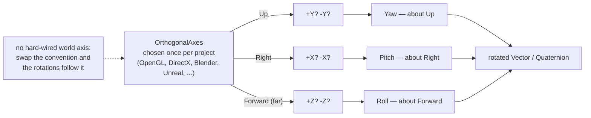

Different worlds disagree, and that is the whole reason the type exists. OpenGL is y-up and
right-handed; Direct3D is y-up and left-handed; Blender and most CAD/engineering maths are z-up;
Unreal is z-up and left-handed. An `OrthogonalAxes` pins that choice down in one immutable value so the rest of
your maths never has to guess.

**It is a label, not a motion.** An `OrthogonalAxes` is meant to be chosen once, at the start, and handed to any
function that needs to know your frame. It never gets rotated — arbitrary orientations are the job of
[`Quaternion`](#orientation-rotation-attitude-quaternion) and [`Pose`](#pose). (This single type
replaces two earlier ones: a label-only `Axis` and a free-vector `OrthogonalAxis` that — by storing
three arbitrary vectors — let you build skewed, non-unit, meaningless "axes". Merging them and keeping
only genuine conventions is what makes a bad frame impossible to construct. The name is the old
`OrthogonalAxis` corrected to the plural it always should have been: it describes a *set* of axes, not
one — and so does not collide with the single direction vector that an axis–angle rotation
(`Quaternion.FromAxisAngle`) calls an "axis".)

### How a convention is built

Each of the three Cartesian axes is given a role from one of the three **opposed pairs**:

- `UP` / `DOWN`
- `LEFT` / `RIGHT`
- `NEAR` / `FAR`

```csharp
var openGl = new OrthogonalAxes(AxisAlignment.RIGHT, AxisAlignment.UP, AxisAlignment.NEAR);
```

The **sign** is carried by *which* member of the pair you choose: `Y = UP` means +y is up; `Y = DOWN`
means +y is down (so up is −y). `Z = FAR` means +z points into the scene; `Z = NEAR` means +z points
back toward the viewer.

A convention must use **each pair exactly once** — so two axes can never both mean "up", and no pair
can be left out. With three axes and three pairs, simply forbidding duplicates is enough to guarantee a
complete, non-contradictory frame, which is why a meaningless `OrthogonalAxes` cannot be constructed at all.

> **Why `NEAR`/`FAR` and not `FORWARD`/`BACKWARD`?** `near` and `far` are *positional* labels — they
> say where a thing **is**, just like `up`/`down` and `left`/`right`. `forward`/`backward` carry a
> sense of **motion**, which belongs to a velocity or a rotation, not to a fixed frame. Naming all
> three pairs as positional opposites keeps the type consistent in kind. (`far` = into the scene, away
> from the viewer; `near` = toward the viewer.)

### The basis vectors and handedness

From the labels alone, an `OrthogonalAxes` derives the signed unit vectors `Right`, `Up` and `Forward` (forward
being the *far* direction — into the scene), and its `Handedness`:

```csharp
OrthogonalAxes.OpenGL.Forward;      // (0, 0, -1) — far is -z, because z is NEAR
OrthogonalAxes.OpenGL.Handedness;   // Handedness.Right
```

These are *derived*, so they can never drift out of step with the labels.

**Handedness, in one gesture.** Point your right hand's fingers along `Right` and curl them toward
`Up`; your thumb gives the right-handed third direction. In numbers:

```
X × Y = (1, 0, 0) × (0, 1, 0) = (0, 0, 1) = +Z
```

With right = +x and up = +y, the right-hand rule puts the third axis at +z. So whether the *far*
direction is +z or −z is exactly what decides handedness:

| Far direction (with right = +x, up = +y) | Handedness |
|------------------------------------------|------------|
| far = −z | **right**-handed |
| far = +z | **left**-handed |

That single fact is the entire difference between OpenGL and Direct3D: same right, same up, opposite
depth. (It is also why "OpenGL is right-handed, yet you look down −z" is not a contradiction — the
*axes* obey the right-hand rule with +z pointing toward you; the camera simply faces the other way.
Where the camera looks is a rendering concern, not part of the convention.) The type computes
handedness as the sign of `(Right × Up) · Forward` — negative is right-handed — so it is read off the
geometry, never typed in by hand.

### The predefined conventions

There is deliberately **no default**. A project must name the convention it wants, because the right
answer depends on the ecosystem the maths is feeding. The common systems are provided as constants;
several share a frame, so the constants are intentional aliases:

| Constant(s) | x | y | z | Up axis | Handed |
|-------------|---|---|---|---------|--------|
| `OrthogonalAxes.OpenGL`, `OrthogonalAxes.Maya`, `OrthogonalAxes.Godot`, `OrthogonalAxes.MathsYUp` | right | up | near | y | right |
| `OrthogonalAxes.DirectX`, `OrthogonalAxes.Direct3D`, `OrthogonalAxes.Unity` | right | up | far | y | left |
| `OrthogonalAxes.Blender`, `OrthogonalAxes.Max3ds`, `OrthogonalAxes.MathsZUp` | right | far | up | z | right |
| `OrthogonalAxes.Unreal` | far | right | up | z | left |

```csharp
OrthogonalAxes.OpenGL.Z;    // NEAR  — +z toward the viewer
OrthogonalAxes.DirectX.Z;   // FAR   — +z into the screen
```

### Translating between conventions

The point of holding a convention as a value is to *feed it into maths that must respect it*.
`OrthogonalAxes.Map` converts coordinates between a stored convention and a canonical right/up/far frame, so a
function can take your `OrthogonalAxes`, map its inputs into the easy canonical frame, do the work once there,
and map the result back — instead of branching on the convention in every method.

---

## Curves: `Bezier`, `Hermite`, `CatmullRom`

[`Vector`](#vector--the-foundation) can already walk between two points in a straight line
(`Interpolate`) or along an arc (`Slerp`). The curve types are the next step: smooth paths that bend
through space, the staple of camera moves, motion paths and easing. All three are immutable and built on
`Vector`, and all are parameterised by a `t` running 0→1 from start to end, with a `PointAt(t)` and a
`Tangent(t)` (the velocity — direction-and-speed — at that point).

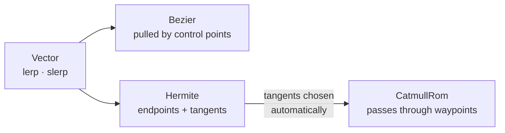

### `Bezier` — pulled toward control points

A Bézier curve is defined by an ordered list of **control points**. It starts at the first and ends at
the last; the interior points pull the curve toward them without being touched. Two control points give
a straight line, three a quadratic, four a cubic (the everyday case), and higher degrees are allowed.

It is evaluated by **de Casteljau's algorithm**: to find the point at `t`, repeatedly replace each
adjacent pair of points with the point a fraction `t` along the segment between them; each pass yields
one fewer point, and the last point left is the answer. It is just repeated straight-line interpolation
all the way down — which is exactly why it reads well as a teaching example. The `Tangent` reuses the
same evaluation on the curve's *derivative*, itself a lower-degree Bézier.

```csharp
var curve = Bezier.Cubic(p0, p1, p2, p3);
Vector here = curve.PointAt(0.25);
Vector vel  = curve.Tangent(0.25);     // heading + speed at that point
double len  = curve.Length(64);         // arc length, approximated by sampling
```

### `Hermite` — endpoints with tangents

A cubic `Hermite` segment is fixed not by off-curve handles but by the two endpoints **and the tangent
(velocity) at each** — exactly the information needed to join segments together smoothly. The point is a
blend of the two endpoints and two tangents weighted by the four cubic *Hermite basis functions*; you can
check by hand that it passes through the endpoints and leaves/arrives along the given tangents.

```csharp
var seg = new Hermite(startPoint, startTangent, endPoint, endTangent);
Vector mid = seg.PointAt(0.5);
```

### `CatmullRom` — through every waypoint

A Catmull–Rom spline passes **through** every one of a sequence of waypoints (unlike a Bézier, whose
interior points it misses) — so it is the natural choice for routing something through positions you have
placed by hand. The trick is that it is just a chain of `Hermite` segments with the tangents filled in
for you: at each waypoint the curve heads along the line through its two neighbours, at half their
separation. That single rule makes the joins smooth without the caller supplying any tangents. The whole
spline takes one `t` from 0 (first waypoint) to 1 (last); `Segment(i)` exposes the underlying `Hermite`.

```csharp
var path = new CatmullRom(a, b, c, d);
Vector p = path.PointAt(0.5);          // halfway along the whole spline, on the curve through the points
```

---

## Shapes: conceptual and placed

The shape types are built around one deliberate split: **what a shape *is*** is kept separate from
**where it *is***.

- A **conceptual shape** — `Triangle`, `Rectangle`, `Cuboid`, `Cylinder` — describes only the intrinsic
  geometry: size and proportion, in no particular place. It has no centre, no orientation, no position
  of any kind. Everything it computes (area, volume, angles, diagonals, classification) depends solely
  on its own dimensions.
- A **placed shape** — `PlacedTriangle`, `PlacedRectangle`, `PlacedCuboid`, `PlacedCylinder` — is a
  conceptual shape **together with a [`Pose`](#pose)** that puts it somewhere in the world. Only the
  placed form answers world-space questions: does it contain this point, what is the closest point on
  it, where does this line or ray strike it.

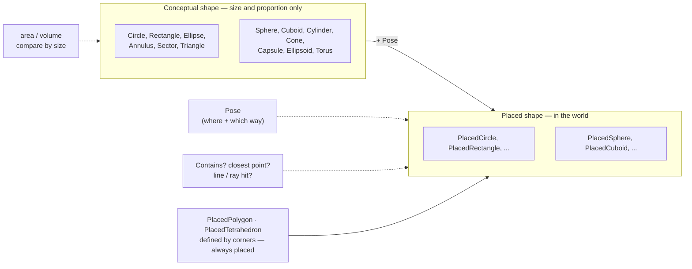

### Why keep them apart

Because position confuses size-only questions. If you want to know which of two circles is bigger, the
honest comparison is between their areas — and a position has no business being part of that answer; it
can only muddy what "bigger" means. Keeping the conceptual shape position-free makes those comparisons
exact and unambiguous:

```csharp
var a = new Cylinder(radius: 2, height: 5);
var b = new Cylinder(radius: 3, height: 1);
bool aIsBigger = a.Volume > b.Volume;   // pure size — no placement anywhere in sight
bool same      = a == b;                 // equality means "same shape", not "same place"
```

Each conceptual shape implements `IComparable<T>` and the comparison operators (`<`, `>`, `<=`, `>=`)
**by size** — area for the flat shapes, volume for the solids — exactly as [`Vector`](#vector--the-foundation)
compares by magnitude. As with `Vector`, `==` still means *equal dimensions*, not *equal size*.

### How a placement is applied

Each conceptual shape has **one hand-written placed partner**, named `Placed` + the shape name (no
cleverer name than that). A placed shape stores the conceptual `Shape` and a `Pose`, and delegates:

```csharp
var disc  = new Rectangle(4, 6);
var board = new PlacedRectangle(disc, Pose.At(new Vector(0, 0, 10)));
board.Area;                       // 24 — delegated straight to the conceptual shape
board.Contains(somePoint, 1e-9);  // a world-space question only the placed form can answer
```

The placed form does its world-space maths by working **in the shape's own local frame**. It maps the
incoming world point back into that frame with `Pose.ApplyInverse`, runs the simple canonical maths
there (where a rectangle is axis-aligned at the origin, a cylinder runs along local +Z, and so on), and
maps any returned point forward again with `Pose.Apply`. Writing the geometry once, in the easy frame,
is the whole reason the two layers are kept apart.

### Placement and symmetry

How much of an orientation actually *matters* depends on the shape's symmetry — which is why the placed
types differ in what their pose meaningfully controls:

| Symmetry | What the placement pins down | Shapes |
|----------|------------------------------|--------|
| Fully symmetric (a point) | only a centre; orientation is irrelevant | `PlacedSphere` |
| Rotationally symmetric about an axis | a centre and one axis direction; spin about it is irrelevant | `PlacedCircle`, `PlacedCylinder`, `PlacedCone`, `PlacedCapsule`, `PlacedAnnulus`, `PlacedTorus` |
| No symmetry to spare | a full orientation | `PlacedRectangle`, `PlacedCuboid`, `PlacedEllipse`, `PlacedEllipsoid`, `PlacedSector` |
| Defined by its corners | placement is implied by the corner positions | `PlacedTriangle`, `PlacedPolygon`, `PlacedTetrahedron` |

A `PlacedSphere` therefore ignores its pose's orientation entirely, and a `PlacedCircle` cares only about
its normal (any spin about that normal leaves the disc unchanged) — the symmetry simply makes the surplus
parts of the `Pose` inert.

### Filled regions

Every shape is treated as a **filled region**, not just an outline or surface. `Contains` means "on or
within"; a `Rectangle` is the solid rectangle, a `Cylinder` is the solid cylinder. This matches the
existing `Sphere`, whose `Contains` has always meant "on or within".

### The shapes

**Flat shapes** (a `Placed…` partner lays each on a plane in space):

| Conceptual shape | Defined by | Placement notes |
|------------------|-----------|-----------------|
| `Circle` | radius | a flat disc; axis symmetry, so the placed form needs only a centre and a normal |
| `Triangle` | three side lengths (A, B, C) | Heron area, angles by the law of cosines, classification; placed form adds corners, containment, closest point, line/ray hits (see special case below) |
| `Rectangle` | width, height | full orientation; placed form lies on a plane with width along local +X, height along +Y |
| `Ellipse` | two semi-axes | full orientation; eccentricity and foci; placed closest-point uses Eberly's robust method |
| `Annulus` | inner & outer radius | axis symmetry; the filled ring between two concentric circles |
| `Sector` | radius, sweep angle | a pie slice; the placed form is anchored at its apex (not its centroid) |

**Solids** (a `Placed…` partner positions each in space):

| Conceptual shape | Defined by | Placement notes |
|------------------|-----------|-----------------|
| `Sphere` | radius | fully symmetric, so the placed form needs only a centre (its pose's orientation is inert) |
| `Cuboid` | width, height, depth | full orientation; oriented box (the slab test runs in its local, axis-aligned frame) |
| `Cylinder` | radius, height | axis symmetry; runs along local +Z, curved side + two caps |
| `Cone` | base radius, height | axis symmetry; placed form stands on its base, closest-point solved in the axial–radial half-plane |
| `Capsule` | radius, cylinder height | axis symmetry; a swept segment (cylinder with two hemispherical caps) |
| `Ellipsoid` | three semi-axes | full orientation; intersection by scaling to a unit sphere, closest-point by a Lagrange-multiplier bisection |
| `Torus` | major & minor radius | axis symmetry; line/ray intersection is an exact **quartic** (see below) |

**Vertex-defined shapes** (positioned in their own right — no conceptual partner):

| Shape | Defined by | Notes |
|-------|-----------|-------|
| `PlacedPolygon` | ordered coplanar corners | any simple polygon (convex or concave); robust area/normal/centroid, crossing-number containment |
| `PlacedTetrahedron` | four corners | the simplest solid; barycentric containment, per-face intersection |

> **"Cuboid", not "Box".** The solid box is named `Cuboid` so the name `Box` stays free for the
> axis-aligned *bounding* box (a different idea — the box that just contains something, used for quick
> rejection — and the reason the earlier `BoundingBox` was removed rather than renamed). That
> [`Box`](#bounding-volumes-box-and-boundingsphere) now exists, alongside a `BoundingSphere`.

### Vertex-defined shapes

`PlacedPolygon` and `PlacedTetrahedron` are defined directly by their corner points, so — like the
corners of `PlacedTriangle` — they are **always placed**: their position is implicit in the corners and
there is no separate conceptual form (hence they carry the `Placed` prefix but have no plain-named
partner). `PlacedPolygon` handles any simple planar polygon, convex or concave (area, normal and centroid
come from summed edge cross-products; containment is a crossing-number test done in the polygon's own
plane). `PlacedTetrahedron` is the simplest solid, with barycentric containment and intersection tested
face by face.

### Exact intersections and the quartic solver

Line/ray intersection is exact for every placed solid. Most reduce to a quadratic in the line parameter
(sphere, cylinder, cone, capsule, and the ellipsoid after scaling space to a unit sphere). The `Torus`
is the exception: substituting the line into its implicit equation gives a **quartic**, so the library
includes a small real-root solver, [`PolynomialRoots`](RP.Math/PolynomialRoots.cs) (quadratic by formula,
cubic by Cardano, quartic by Ferrari). A line can pierce a torus up to four times; the solver returns all
real crossings and the placed torus reports the nearest and farthest.

### `Triangle`, the special case

A triangle is the one shape whose natural placed form is its **three corners**, not a tidy centre and
size. Its conceptual form is therefore its three **side lengths** — the position-free description that
still fixes area, angles and classification. `PlacedTriangle` stores that `Triangle` plus a `Pose` whose
position is the triangle's centroid; in the local frame the centroid sits at the origin, the A→B edge
runs along local +X and corner C lies on the local +Y side (a layout recovered from the side lengths via
the law of cosines).

The everyday way to build one is from three world corners:

```csharp
var t = PlacedTriangle.FromVertices(a, b, c);   // recovers both the side lengths and the placing pose
t.A; t.B; t.C;                                   // round-trips back to the original corners
```

`FromVertices` has to turn three points into a `Pose`, which means recovering an orientation from a
coordinate frame. Rather than assemble a rotation matrix and read it back (`Matrix.ToQuaternion` could
do that), the rotation is built directly by **composing the library's own quaternion turns** — first
`Quaternion.FromToRotation` to swing local +Z onto the face normal, then a `Quaternion.FromAxisAngle`
spin about that normal to line local +X up with the A→B edge. Building it from the orientation
primitives keeps it consistent with the quaternion conventions used everywhere else, and avoids assuming
the recovered frame is perfectly orthonormal (and the round-trip is covered by tests).

### `Circle` and `Sphere`

`Circle` and `Sphere` follow the same split as everything else: the conceptual `Circle` is just a radius
(area, circumference) and the conceptual `Sphere` is just a radius (volume, surface area), each comparable
by size, while `PlacedCircle` and `PlacedSphere` add the placement and the world-space maths. They were
originally written as positioned types and have been converted to match — `PlacedCircle.InXYPlane(circle,
centre)` and `PlacedSphere.At(sphere, centre)` are the everyday factories.

### Decisions captured here

- **Conceptual and placed are separate types.** Size-only maths lives on the conceptual shape and never
  sees a position; world-space maths lives on the placed shape.
- **Paired concrete types, not a generic wrapper.** Each shape has its own hand-written placed partner
  rather than a single `Placed<T>` over an interface (an earlier `IShape` abstraction was removed).
- **Named `Placed` + the shape name.** `PlacedTriangle`, `PlacedRectangle`, and so on — no invented names.
- **A placed shape is a conceptual shape plus a `Pose`.** World queries are done in the shape's local
  frame via `ApplyInverse`/`Apply`.
- **Shapes are filled regions.** `Contains` means "on or within".
- **Conceptual shapes are comparable by size** (`IComparable`, comparison operators), mirroring `Vector`.
- **Vertex-defined shapes are always placed.** `PlacedPolygon` and `PlacedTetrahedron` are defined by
  general corner points (not regularised), so they have no conceptual partner; they carry the `Placed`
  prefix because they only ever exist positioned — matching how `PlacedTriangle`'s corners already work.
- **`Circle` and `Sphere` follow the split too.** Originally positioned, they are now a conceptual radius
  plus `PlacedCircle` / `PlacedSphere`, consistent with every other shape.
- **Intersections are exact, including the torus.** Rather than approximate the torus's line/ray hits, a
  real quartic solver (`PolynomialRoots`) was added so its crossings are exact like the other solids'.

---

## Bounding volumes: `Box` and `BoundingSphere`

The exact shapes above answer questions precisely — and sometimes expensively. A **bounding volume** is
the opposite trade: a crude hull that is cheap to test, used for **quick rejection** — the fast "could
these two things *possibly* touch?" you run before any exact geometry. Both types are immutable, built on
`Vector`, and treat themselves as filled regions (`Contains` means "on or within").

### `Box` — the axis-aligned bounding box (AABB)

A `Box` is described by two opposite corners, a `Min` and a `Max`, with faces parallel to the coordinate
planes. Because the faces never tilt, containment and overlap are just per-axis number comparisons — which
is the whole point. (This is the `Box` the [shapes note](#the-shapes) reserved the name for; it is a
different idea from the oriented solid [`Cuboid`](#shapes-conceptual-and-placed), which can sit at any
angle.)

```csharp
Box b   = Box.FromPoints(p0, p1, p2);          // smallest AABB enclosing some points
Box ce  = Box.FromCenterExtents(centre, half); // …or from a centre and half-size
bool in = b.Contains(point);
bool hit = b.Intersects(other);                 // touching faces count
Vector near = b.ClosestPoint(point);            // clamps the point into the box
Box grown = b.Merge(other).Expand(0.1);         // union, then a safety margin
```

Line and ray hits use the **slab method**: an AABB is the overlap of three pairs of parallel planes
("slabs"), one per axis; intersect the per-axis parameter spans and a non-empty result is the hit. It is
spelled out in the source.

```csharp
if (b.TryIntersect(ray, out Vector entry)) { /* … */ }
if (b.TryIntersect(line, out Vector nearP, out Vector farP)) { /* … */ }
```

### `BoundingSphere` — a centre and a radius

A `BoundingSphere` is the rotation-independent counterpart: a centre and radius, so it needs no re-fitting
when the thing it wraps turns, and the overlap test between two spheres is a single distance comparison. It
is distinct from [`PlacedSphere`](#circle-and-sphere) — that is a geometric sphere with full surface/volume
maths and exact line/ray hits; this is a lightweight hull focused on containment and overlap.

`FromPoints` fits one with **Ritter's algorithm**: span the two points found farthest apart in a quick
scan, then sweep once more, growing the sphere just enough whenever a stray point falls outside. The result
is small (though not provably the smallest) and cheap.

```csharp
BoundingSphere s = BoundingSphere.FromPoints(points);
bool hitsBox  = s.Intersects(box);
bool hitsBall = s.Intersects(other);
BoundingSphere grown = s.Merge(extraPoint);
```

---

## Supporting numeric helpers

A small amount of plumbing supports the maths above and is not usually called directly:

- **`DoubleExtension`** — floating-point comparison helpers (e.g.
  `AlmostEqualsWithAbsTolerance`) used throughout for tolerance-aware equality. Compares doubles
  sensibly rather than with the unreliable `==`.
- **`ExpandedDouble`, `UlongExtension`** — bit-level inspection of doubles, used by the ULP
  ("units in the last place") comparison strategy.
- **`Tolerance`** — interfaces and strategies (`UlpsTolerance` and others) describing *how close is
  close enough* when comparing values.
- **`Exceptions/NormalizeVectorException`, `Exceptions/NormalizeQuaternionException`** — the errors
  thrown by the strict `Normalize` methods when asked to normalise a zero-length value (the
  `…OrDefault` variants avoid these).

> The `Shape` namespace is documented above under [Shapes: conceptual and
> placed](#shapes-conceptual-and-placed).

---

## Points of interest

A number of resources informed the original vector article and the maths in this library:

- [CSOpenGL](http://sourceforge.net/projects/csopengl/) — Lucas Viñas Livschitz
- [Exocortex](http://www.exocortex.org/) — Ben Houston
- *Essential Mathematics for Computer Graphics* — John Vince (ISBN 1-85233-380-4)

---

## Future considerations

A running list of design questions that have been *thought through* but deliberately **not yet
built** — recorded here so the reasoning is not lost, and so the eventual implementation starts from a
conclusion rather than from a blank page. The guiding decision in every case below is the same: wait
until real usage makes the right shape obvious rather than committing to an abstraction early.

### A shared contract for the line family (and possibly the shapes)

The [line family](#the-line-family-line-ray-linesegment-chord) is presented as "one family", but that
family is currently a *documentation* grouping, not something the type system enforces: `Line`, `Ray`
and `LineSegment` are unrelated classes (only `Chord` inherits — from `LineSegment`). A natural next
step is a shared interface so that code can hold "some straight path" without caring which kind it is —
useful for operations like *snap to the nearest path under the cursor* or *is this click within
tolerance of any path*, where the per-type clamping should be the path's business, not the caller's.

Two findings from thinking it through are worth preserving.

**1. The anchor point is named differently on purpose, and should stay that way.** The stored point is
`Line.Point`, `Ray.Origin`, and `LineSegment.Tail` / `Head`. This *looks* inconsistent, but the
inconsistency is honest: a `Line` is infinite both ways and has **no** start, so its point is merely an
arbitrary representative; a `Ray` genuinely **begins** at its origin; a `LineSegment` genuinely has
**two** ends. No single shared name is true for all three — `Origin` / `Start` / `Tail` would falsely
imply a line begins somewhere, and a bland `Point` everywhere would hide the fact that a ray's anchor is
its whole defining feature. The conclusion: **do not rename to unify.** A shared interface should expose
the *behaviour* the family shares (direction and parametric evaluation, below), not the anchor *data*
they differ on. (If a single neutral name were ever forced, only `Anchor` — "the point at parameter
zero", which claims nothing about being a start — would be acceptable; but per-type clarity is the
better trade.)

**2. The obvious interface is too narrow — it actually spans the shapes too.** A first sketch put five
members on an `IStraightPath`: `Direction`, `PointAt`, closest-point, `DistanceTo` and `Contains`. But
checking the real surface shows three of those are *not* path-specific at all — every `Placed…` shape
and `Plane` already implement closest-point and `Contains`. So the honest design is **layered**, not a
single interface:

- a broad capability — *"a piece of geometry you can ask point-queries of"* — carrying `Contains`,
  closest-point and `DistanceTo`, implemented by the line family, the placed shapes **and** `Plane`;
- a narrow straight-path specialization on top, adding the genuinely one-dimensional members
  `Direction` and `PointAt`, implemented by the line family alone.

### Inconsistencies to reconcile first

Whatever shape the interfaces eventually take, they cannot be written until a few naming and coverage
gaps — surfaced while exploring the above — are settled. Each is worth fixing in its own right,
independently of any interface:

- **Closest-point has two names for one operation:** `ClosestPointTo(point)` on the line family versus
  `ClosestPoint(point)` on every shape and on `Plane`. One name must win before either can share a
  contract.
- **`Contains` coverage is uneven:** it exists on `Line` but not on `Ray` or `LineSegment`, while every
  shape carries both a `Contains(point)` and a `Contains(point, tolerance)` overload.
- **`DistanceTo` ✓ resolved.** It was missing on the placed shapes (the line family and `Plane` already
  had it). Every placed shape now carries `DistanceTo(point)` — the one-liner
  `(point − ClosestPoint(point)).Magnitude`, which is zero on or within the shape. `PlacedSphere`, whose
  closest-point method returns a *surface* point, instead defines it as `Max(0, SignedDistanceTo(point))`
  so "inside ⇒ 0" holds uniformly.
- **An open question of *meaning*:** `Contains` on a filled shape means "on or within"; on a
  zero-thickness line / ray / segment it can only mean "lies on". The signature and intent match, but
  whether that is genuinely *the same concept* — and therefore safe to place on one shared interface —
  is exactly the kind of false-implication risk this library tries hard to avoid, and should be settled
  deliberately rather than by accident.
- **Intersection out-parameters ✓ resolved.** The `Line` overload used to disagree — `out Vector point`
  on the flat shapes (one crossing), `out Vector near, out Vector far` on the solids (two). They are now
  unified on `out Vector near, out Vector far` everywhere: a flat shape meets an infinite line at most
  once, so it reports that single crossing as `near == far` — the same convention solids already use when
  a line grazes. (The `Ray` overload was already uniform, returning the first hit as `out Vector point`.)

### Generic positioning, keyed on symmetry

Today every shape has a hand-written `Placed…` partner, and each placed shape stores a full
[`Pose`](#pose) regardless of how much of that pose the shape's symmetry actually uses. But the
[placement-and-symmetry table](#placement-and-symmetry) already shows that the *amount of placement a
shape needs* falls into only a few distinct kinds — and that, in turn, decides whether a shape really
needs a whole pose or merely a vector:

- **A point only — a bare `Vector`.** A fully symmetric shape (`Sphere`) needs just a centre;
  orientation is meaningless, so a `PlacedSphere` handed an orientation simply ignores it.
- **A point and an axis — a `Vector` centre plus one direction.** An axially-symmetric shape (`Circle`,
  `Cylinder`, `Cone`, `Capsule`, `Annulus`, `Torus`) needs a centre and a single axis; spin about that
  axis is irrelevant, so the roll part of a pose is wasted.
- **A full `Pose`.** Only an asymmetric shape (`Rectangle`, `Cuboid`, `Ellipse`, `Ellipsoid`, `Sector`)
  genuinely needs a complete orientation.
- **Corners.** Vertex-defined shapes (`PlacedTriangle`, `PlacedPolygon`, `PlacedTetrahedron`) carry
  their placement implicitly in their points and need no separate positioning value at all.

That clustering is a strong hint that the placement layer could be expressed with **a small number of
generics keyed on the placement kind**, rather than one bespoke class per shape — so that each placed
type carries *exactly the placement data its symmetry justifies*. A couple of sketches, to be refined
later:

```csharp
// Fully symmetric: positioned by a single point.
public readonly struct PointPlaced<TShape> { TShape Shape; Vector Centre; /* … */ }

// Axially symmetric: positioned by a centre and one axis direction (spin about it is irrelevant).
public readonly struct AxialPlaced<TShape> { TShape Shape; Vector Centre; Vector Axis; /* … */ }

// No symmetry to spare: positioned by a full pose.
public readonly struct PosePlaced<TShape> { TShape Shape; Pose Pose; /* … */ }
```

Done well, this would make a meaningless placement impossible to construct — a `Sphere` could no longer
be given an orientation it ignores — in the same spirit that [`OrthogonalAxes`](#orthogonalaxes) made a
meaningless coordinate frame impossible to build.

Two cautions, which is exactly why this is filed under *future* and not *now*:

- **It reopens a decision already taken.** The shapes section deliberately chose
  [paired concrete types over a generic wrapper](#decisions-captured-here), and an earlier blanket
  `IShape` / `Placed<T>` was removed because the world-space maths differs too much shape to shape to
  hide behind one interface. The proposal here is narrower — generics keyed on *placement kind*, not one
  wrapper over everything — but it still revisits that ground and must earn its place.
- **It only pays off once the pairs are right.** The conceptual/placed pairs are still settling, and
  abstracting over them now risks freezing an interface before the per-shape maths has proven its shape.
  **Get the hand-written pairs correct first**, let the genuinely-common positioning operations reveal
  themselves, and only then lift the repeated ones into a generic. The rule is that the generics should
  be *extracted from* working pairs, never *imposed on* them.

### Fixed: `Angle`'s unary minus is now a true negation

`Angle`'s unary `-` operator used to **not** return the opposite angle — it returned a *coterminal*
re-expression of the same turn with a negative winding label. For a positive (clockwise) `0.9` it yielded
`0.9 − 2π` (≈ −5.383), which lands on the **same** orientation as `+0.9` (they differ by a full circle),
not on the inverse `−0.9`. That broke two expectations every *other* unary minus in the library upholds:
it was not involutive (`-(-x) ≠ x`), and it disagreed with `Vector` and `Quaternion`, where unary `-`
means "the opposite" — so building an inverse rotation as `-angle` produced a silently wrong axis-angle.

Unary `-` now negates the raw radians (`new Angle(-a.Rad)`): `-a` is the true opposite, and
`a + (-a) == 0`. The original "same physical turn, measured the other way round the circle" behaviour was
not a defect of *concept*, only of being bound to the `-` symbol — it now lives in the clearly-named
`CounterClockwise()`/`Clockwise()` methods, and the `!` operator (toggle the winding) is built on those.
Guarded by `Angle_UnaryMinus_NumericallyNegates_Test` in `MathematicalBugTests`.

(The convention-aware `Roll` vs literal `RotateZ` sign relationship — once listed here — is **not** a
defect: it is the principled API being correct. It is documented as a strength under
[Rotation: yaw, pitch and roll](#rotation-yaw-pitch-and-roll) and guarded by a positive test,
`Roll_HonoursEachFramesForward_RelatingToLiteralRotateZ`.)

### Fixed: `Angle.ToAngleValue` reduction now keeps sign and range

`Angle.ToAngleValue` used to normalise an out-of-range radian with
`rad > 2π ? IEEERemainder(rad, 2π) : rad`. `IEEERemainder` returns a value in `[−π, π]`, **not** the
`[0, 2π)` the type otherwise works in, so reducing `540°` (`3π`) gave `IEEERemainder(3π, 2π) = −π = −180°`
— even though the method's own doc comment promises "3·PI (540 degree) ==> PI (180 degree)". The guard
also only fired for `rad > 2π`, leaving large *negative* angles unreduced entirely.

It now reduces with the ordinary remainder, `rad % 2π`, which **keeps the sign of the input** (so the
clockwise/counter-clockwise winding is preserved) and maps `540° → 180°` exactly as the doc comment
promises, while reducing large negative angles symmetrically. Guarded by
`Angle_ReduceFiveFortyDegrees_GivesOneEighty_PerOwnDocstring_Test`.

---

## Status and history

The library began as the single `Vector3` type from the CodeProject article (since renamed `Vector`)
and has grown to cover the line family, planes, angles, the orientation types, poses and matrices —
all in the spirit of the original: small immutable values, rich and well-explained mathematical
functionality, clarity ahead of speed.

It is an early-state, actively-developing project: the core numeric types are well covered by tests.
The former `Axis` and `OrthogonalAxis` types are now merged into a single `OrthogonalAxes` convention,
which carries the coordinate-frame logic they left unfinished and exposes the major systems (OpenGL,
Direct3D, Unity, Unreal, Blender, …) as named constants. The yaw/pitch/roll rotation API now consumes
an `OrthogonalAxes` in both directions (`Attitude.ToQuaternion(axes)` / `FromQuaternion(q, axes)`,
`Vector.Yaw/Pitch/Roll(angle, axes)`): there is no longer any rotation entry point that silently
assumes a fixed up/right/forward. The `Shape`
types follow a settled conceptual/placed split — `Circle`, `Sphere`, `Triangle`, `Rectangle`, `Ellipse`,
`Annulus`, `Sector`, `Cuboid`, `Cylinder`, `Cone`, `Capsule`, `Ellipsoid` and `Torus`, each with a
`Placed…` partner, plus the always-placed `PlacedPolygon` and `PlacedTetrahedron`. More recently the
`Matrix` gained a true `Inverse` and right-handed view/projection builders (`LookAt`,
`PerspectiveFieldOfView`, `Orthographic`) with a perspective-divide `Transform`; `Quaternion` gained
direction-based construction (`FromToRotation`, `LookRotation`); `Plane` gained plane-plane intersection;
every placed shape gained `DistanceTo`; and two new families joined: the curves (`Bezier`, `Hermite`,
`CatmullRom`) and the axis-aligned bounding volumes (`Box`, `BoundingSphere`).
