# A Vector Type for C#

> A walk-through of a reusable double-precision `Vector3` type in C#, built on Cartesian
> coordinates and Euclidean geometry. The code favours clarity over raw speed so the maths
> stays easy to follow.

*Originally published by Richard Potter on [CodeProject](https://www.codeproject.com/Articles/17425/A-Vector-Type-for-C) under the [Code Project Open License (CPOL)](https://www.codeproject.com/info/cpol10.aspx). The source discussed here lives in this repository under `RP.Math.Vector3/`.*

**Contents**

- [Introduction](#introduction)
- [Using the code](#using-the-code)
- [Extended functionality](#extended-functionality)
- [Usability functions](#usability-functions)
- [Additional operations](#additional-operations)
- [Summary](#summary)
- [Points of Interest](#points-of-interest)
- [History](#history)

---

## Introduction

For years I have seen people struggle with vector mathematics. This
guide should walk you through the creation of a reusable `Vector` type
and the mathematics behind it all. The resulting code is not designed to
be fast or efficient but is to be as simple and understandable as
possible.

I havel used the Cartesian coordinate system in three-dimensions (i.e.
three perpendicular axis of x, y and z) and Euclidian geometry. Don't
worry about these terms, they are just the formal names for some of the
maths covered at senior school. The vector space is volumetric (cube);
note that you can use other vector spaces, such as a cylindrical space
where one axis (usually z) relates to the radius of the cylinder.

You may have guessed that computers are quite slow with this type of
math. Matrix mathematics is more efficient but much harder to
understand. You will need a basic grasp of trigonometry and algebra to
understand this guide.

Unless stated otherwise I assume that the vector is positional,
originating at point (0,0,0). Alternatives to positional vectors are:
unit vectors, which can be interpreted as either having no magnitude or
an infinite magnitude; and vector pairs where the origin of the vector
is another vector, magnitude being a distance from the origin vector.

Please note that this guide is extremely verbose and goes into far too
much detail for a normal C# programmer. Please do not be offended if any
part of this seems patronising. I have written the guide for a wide
audience.

A quick glossary:

- Operator, this is the symbol used to define an operation such as plus
  (`+`) in (a+b)
- Operand, these are the variables used in an operation such as (a)
  and (b) in (a+b). The left-hand-side (LHS) operand is (a) where as the
  right-hand-side (RHS) operand is (b).

All of the equations in this guide assume A (or v1) and B (or v2) can be
broken down into:

$A = \begin{pmatrix} a \\ b \\ c \end{pmatrix}$
$B = \begin{pmatrix} d \\ e \\ f \end{pmatrix}$

## Using the code

To begin with let us define how the vector information will be stored. I
don't often create structs when coding but for our `Vector` this is
perfect. If you are reading this article you probably already know that
a vector represents values along a number of axes. For this tutorial we
will be developing a three-dimensional type so... thee variables and
three axis.

```csharp
public struct Vector
{
   private double x, y, z;
}
```

What orientation are the axes in? Well, for the type we are building it
doesn't matter but I always assume:

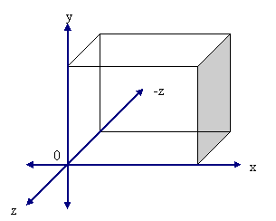

You may have noticed that Z is negative as you look down the axis. This
is a common convention in graphics libraries such as OpenGL. Again,
these axis have no affect on our code.

**A quick diversion**: Why a struct instead of a class?\
\
The differences between struct and class:

- A struct is a value type created on the stack instead of the heap,
  thus reducing garbage collection overheads.
- They are passed by value not by reference.
- They are created and disposed of quickly and efficiently.
- You cannot derive other types from them (i.e. non-inheritable).
- They are only appropriate for types with a small number of members
  (variables). Microsoft recommends a struct should be less than 16
  bytes.
- You do not need the new keyword to instantiate a struct.

Basically, it looks like, acts like, and is a primitive type. Although,
there is no reason why the vector type could not be created as a class.\
A more in-depth article on structs has been written by S. Senthil Kumar
at <http://www.codeproject.com/csharp/structs_in_csharp.asp>

**Accessing the variables**

Did you notice that the variables were private?\
\
While I have chosen to build a struct, I habitually hide my variables
and create public accessor and mutator properties. This is not strictly
good practice for structs, but I have created them in case I feel the
need to convert to a class at a later date (this is good practice for
classes).\
\
In addition to the properties, an array style interface has also been
provided. This lets the user call the `Vector` with `myVector[x]`,
`myVector[y]`, `myVector[z]`. Additionally, the user can get or set all
of the components as an array using the `Array` property, i.e.
`myVector.Array = {x,y,z}`.

```csharp
public double X
{
   get{return x;}
   set{x = value;}
}

public double Y
{
   get{return y;}
   set{y = value;}
}

public double Z
{
   get{return z;}
   set{z = value;}
}

public double[] Array
{
   get{return new double[] {x,y,z};}
   set
   {
      if(value.Length == 3)
      {
         x = value[0];
         y = value[1];
         z = value[2];
      }
      else
      {
         throw new ArgumentException(THREE_COMPONENTS);
      }
   }
}

public double this[ int index ]
{
   get
   {
      switch (index)
      {
         case 0: {return X; }
         case 1: {return Y; }
         case 2: {return Z; }
         default: throw new ArgumentException(THREE_COMPONENTS, "index");
     }
   }
   set
   {
       switch (index)
       {
          case 0: {X = value; break;}
          case 1: {Y = value; break;}
          case 2: {Z = value; break;}
          default: throw new ArgumentException(THREE_COMPONENTS, "index");
      }
   }
}
private const string THREE_COMPONENTS = "Array must contain exactly three components, (x,y,z)";
```

To construct the type using typical class syntax the following
constructir methods have been provided:

```csharp
public Vector(double x, double y, double z)
{
   this.x = 0;
   this.y = 0;
   this.z = 0;

   X = x;
   Y = y;
   Z = z;
}

public Vector (double[] xyz)
{
   this.x = 0;
   this.y = 0;
   this.z = 0;

   Array = xyz;
}

public Vector(Vector v1)
{
   this.x = 0;
   this.y = 0;
   this.z = 0;

   X = v1.X;
   Y = v1.Y;
   Z = v1.Z;
}
```

We now have a framework for storing, accessing and mutating the `Vector`
and its components (x,y,z). We can now consider mathematical operations
applicable to a vector. Let's begin by overloading the basic
mathematical operators.

**Operator overloading**

Overloading operators allows the programmer to define how a type is used
in the code. Take, for example, the plus operator (`+`). For numeric
types this would suggest addition of two numbers. For strings it
represents the concatenation of two strings. Operator overloading is of
huge benefit to programmers when describing how a type should interact
with the system. In C# the following operators can be overloaded:

- Addition, concatenation, and reinforcement (`+`)
- Subtraction and negation (`-`)
- Logical negation (`!`)
- Bitwise complement (`~`)
- Increment (`++`)
- Decrement (`--`)
- Boolean Truth (`true`)
- Boolean false (`false`)
- Multiplication (`*`)
- Division (`/`)
- Division remainder (`%`)
- Logical AND (`&`)
- Logical OR (`|`)
- Logical Exclusive-OR (`^`)
- Binary shift left (`<<`)
- Binary shift right (`>>`)
- Equality operators, equal and not-equal (`==` and `!=`)
- Difference\comparison operators, less-than and greater-than(`<` and
  `>`)
- Difference\comparison operators, less-than or equal-to and
  greater-than or equal-to(`<=` and `>=`)

**Operator overloads for the `Vector` type**

**Addition** (v3 = v1 + v2)

The addition of two vectors is achieved by simply adding the x, y, and z
components of one vector to the other (i.e. x+x, y+y, z+z).

```csharp
public static Vector operator+(Vector v1, Vector v2)
{
   return
   (
      new Vector
      (
         v1.X + v2.X,
         v1.Y + v2.Y,
         v1.Z + v2.Z
      )
   );
}
```

**Subtraction** (v3 = v1 + v2)

Subtraction of two vectors is simply the subtraction of the x, y, and z
components of one vector from the other (i.e. x-x, y-y, z-z).

```csharp
public static Vector operator-(Vector v1, Vector v2 )
{
   return
   (
      new Vector
      (
          v1.X - v2.X,
          v1.Y - v2.Y,
          v1.Z - v2.Z
      )
   );
}
```

**Negation** (v2 = -v1)

Negation of a vector inverts its direction. This is achieved by simply
negating each of the component parts of the vector.

```csharp
public static Vector operator-(Vector v1)
{
   return
   (
      new Vector
      (
         - v1.X,
         - v1.Y,
         - v1.Z
      )
   );
}
```

**Reinforcement** (v2 = +v1)

Reinforcement of a vector actually does nothing but return the original
vector given the rules of addition, (i.e. +-x = -x and ++x = +x).

```csharp
public static Vector operator+(Vector v1)
{
   return
   (
      new Vector
      (
         + v1.X,
         + v1.Y,
         + v1.Z
      )
   );
}
```

**Comparison** (\<, \>, \<=, and \>=)

When comparing two vectors we use magnitude. The magnitude of a vector
is its length, irrespective of direction.

**Magnitude**\
The length (or magnitude) of a vector can be determined using the
formula .

```csharp
public static double Magnitude(Vector v1)
{
   return
   (
      Math.Sqrt
      (
         v1.X * v1.X +
         v1.Y * v1.Y +
         v1.Z * v1.Z
      )
    );
}
```

Where possible I have created static methods to extend the programmer's
options when making use of the type. Methods which directly affect or
are effected by the instance simply call the static methods.

```csharp
public double Magnitude()
{
   return Magnitude(this);
}
```

Returning to the comparison operators ...

**Less-than** (result = v1 \< v2)

Less-than compares two vectors, returning true only if the magnitude of
the left-hand-side vector (v1) is less than the magnitude of the other
(v2).

```csharp
public static bool operator<(Vector v1, Vector v2)
{
   return v1.Magnitude() < v2.Magnitude();
}
```

**Less-than or Equal-to** (result = v1 \<= v2)

Less-than or equal-to compares two vectors returning true only if the
magnitude of the left-hand-side vector (v1) is less than the magnitude
of the other (v2) or the two magnitudes are equal.

```csharp
public static bool operator<=(Vector v1, Vector v2)
{
   return v1.Magnitude() <= v2.Magnitude();
}
```

**Greater-than** (result = v1 \> v2)

Greater-than compares two vectors returning true only if the magnitude
of the left-hand-side vector (v1) is greater than the magnitude of the
other (v2).

```csharp
public static bool operator>(Vector v1, Vector v2)
{
   return v1.Magnitude() > v2.Magnitude();
}
```

**Greater-than or Equal-to** (`result = v1 >= v2`)

Greater-than or equal-to compares two vectors returning true only if the
magnitude of the left-hand-side vector (v1) is grearter than the
magnitude of the other (v2) or the two magnitudes are equal.

```csharp
public static bool operator>(Vector v1, Vector v2)
{
   return v1.Magnitude() >= v2.Magnitude();
}
```

**Equality** (`result = v1 == v2`)

To check if two vectors are equal we simply check the component pairs.
We AND the results so that any pair which is not equal will result in
false.

```csharp
public static bool operator==(Vector v1, Vector v2)
{
   return
   (
      (v1.X == v2.X)&&
      (v1.Y == v2.Y)&&
      (v1.Z == v2.Z)
   );
}
```

**Inequality** (`result = v1 != v2`)

If the operator == (equal) is overridden, C# forces us to override !=
(not-equal). This is simply the inverse of equality.

```csharp
public static bool operator!=(Vector v1, Vector v2)
{
   return !(v1==v2);
}
```

**Division** (`v3 = v1 / s2`)

Division of a vector by a scalar number (e.g. 2) is achieved by dividing
each of the component parts by the divisor (s2).

```csharp
public static Vector operator/(Vector v1, double s2)
{
   return
   (
      new Vector
      (
         v1.X / s2,
         v1.Y / s2,
         v1.Z / s2
      )
   );
}
```

**Multiplication** (dot, cross, and by scalar)

Multiplication of vectors is tricky. There are three distinct types of
vector multiplication:

- Multiplication by a scalar (v3 = v1 \* s2)
- Dot product (s3 = v1 . v2)
- Cross product (v3 = v1 \* v2)

Only multiplication by scalar and division by scalar have been
implemented as operator overloads. I have seen operators such as `~`
overloaded for the dot product to distinguish it from cross product; I
believe that this can lead to confusion and have choosen not to provide
operators for dot and cross products leaving the user to call the
appropriate method instead.

**Multiplication by scalar** is achieved by multiplying each of the
component parts by the scalar value.

```csharp
public static Vector operator*(Vector v1, double s2)
{
   return
   (
      new Vector
      (
         v1.X * s2,
         v1.Y * s2,
         v1.Z * s2
      )
   );
}
```

The order of operands in multiplication can, of course, be reversed.

```csharp
public static Vector operator*(double s1, Vector v2)
{
   return v2 * s1;
}
```

The **cross product** of two vectors produces a normal to the plane
created by the two vectors given.

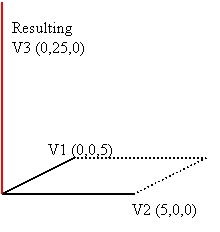

The formulae for this (where v1 = A and v2 = B) is


The equation should always produce a vector as the result.

The sine of theta is used to account for the direction of the vector.
Theta always takes the smallest angle between A and B (i.e.
).

The right hand side of the formula is arrived at by expanding and
simplifying the left hand side using the rules:

Sin 0° = 0

Sin 90° = 1

In a matrix style notation this looks like:

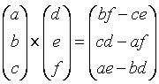

You should be aware that this equation is non-commutable. This means
that v1 cross-product v2 is NOT the same as v2 cross-product v1.

The C# code for all of this is:

```csharp
public static Vector CrossProduct(Vector v1, Vector v2)
{
   return
   (
      new Vector
      (
         v1.Y * v2.Z - v1.Z * v2.Y,
         v1.Z * v2.X - v1.X * v2.Z,
         v1.X * v2.Y - v1.Y * v2.X
      )
   );
}
```

And the instance counterpart of the static method is:

```csharp
public Vector CrossProduct(Vector other)
{
   return CrossProduct(this, other);
}
```

Note that this instance method does not affect the instance from which
it is called but returns a new `Vector` object. I have chosen to
implement cross product in this fashion for two reasons; one, to make it
conistant with dot product which cannot produce a vector, and two,
because cross product is usualy used to generate a normal used somewhere
else, the origional vecotor needing to be left intact.

\[Side note\] A quick template for manualy calculating the cross product
of two vectors is:

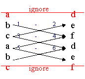

The **dot product** of two vectors is a scalar value defined by the
formulae;


The equation should always produce a scalar as the result.

Cosine theta is used to account for the direction of the vector. Theta
always takes the smallest angle between A and B (i.e.
).

The right hand side of the formula is arrived at by expanding and
simplifying the left hand side using the rules:

Cos 0° =1

Cos 90° = 0

The C# code for this is:

```csharp
public static double DotProduct(Vector v1, Vector v2)
{
   return
   (
      v1.X * v2.X +
      v1.Y * v2.Y +
      v1.Z * v2.Z
   );
}
```

And its counterpart:

```csharp
public double DotProduct(Vector other)
{
   return DotProduct(this, other);
}
```

## Extended functionality

We now have all the basic functionality required of a `Vector` type. To
make this type really useful I have provided some additional
functionality.

**Magnitude** *revisited*

We have already seen the method to get the magnitude or length of a
vector. Here is a method to alter a vector's magnitude.

```csharp
public static Vector Magnitude(Vector v1, double newMagnitude)
{
   if (newMagnitude < 0)
   {throw new ArgumentOutOfRangeException("newMagnitude", newMagnitude, NEGATIVE_MAGNITUDE);}

   if (v1 == new Vector(0, 0, 0))
   {throw new ArgumentException(ORAGIN_VECTOR_MAGNITUDE, "v1");}

   return
   (
      new Vector
      (
         v1 * (newMagnitude / v1.Magnitude())
      )
   );
}

public void Magnitude(double newMagnitude)
{
   this = Magnitude(this, newMagnitude);
}

private const string NEGATIVE_MAGNITUDE = "The magnitude of a Vector must be a positive value, (i.e. greater than 0)";
private const string ORAGIN_VECTOR_MAGNITUDE = "Cannot change the magnitude of Vector(0,0,0)";
```

**Normalisation and Unit Vector**

A unit vector is one which has a magnitude of 1. To test if a vector is
a unit vector we simply check for 1 against the magnitude method already
defined.

```csharp
public static bool IsUnitVector(Vector v1)
{
   return v1.Magnitude() == 1;
}

public bool IsUnitVector()
{
   return IsUnitVector(this);
}
```

Normalization is the process of converting some vector to a unit vector.
The formula for this is:


```csharp
public static Vector Normalize(Vector v1)
{
   // Check for divide by zero errors
   if ( v1.Magnitude() == 0 )
   {
      throw new DivideByZeroException( NORMALIZE_0 );
   }
   else
   {
      // find the inverse of the vectors magnitude
      double inverse = 1 / v1.Magnitude();
      return
      (
         new Vector
         (
            // multiply each component by the inverse of the magnitude
            v1.X * inverse,
            v1.Y * inverse,
            v1.Z * inverse
         )
      );
   }
}

public void Normalize()
{
   this = Normalize(this);
}

private const string NORMALIZE_0 = "Can not normalize a vector when it's magnitude is zero";
```

The normalization instance method directly affects the instance.

**Interpolation**

This method takes an interpolated value from between two vectors. This
method takes three arguments, a starting point (vector v1), and end
point (Vector v2), and a control which is a fraction between 1 and 0.
The control determines which point between v1 and v2 is taken. A control
of 0 will return v1 and a control of 1 will return v2.

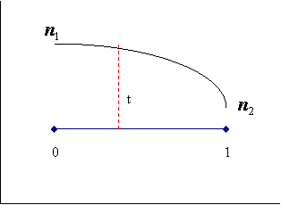

$n = n_1(1 - t) + n_2 t$

or:

$n = n_1 + t(n_2 - n_1)$

or:

$n = n_1 + t n_2 - t n_1$

or:


where:

$n$ = Current value

$n_1$ = Initial value (v1)

$n_2$ = Final value (v2)

$t$ = Control parameter, where
, and where,
,


```csharp
public static Vector Interpolate(Vector v1, Vector v2, double control)
{
   if (control >1 || control <0)
   {
      // Error message includes information about the actual value of the argument
      throw new ArgumentOutOfRangeException
      (
          "control",
          control,
          INTERPOLATION_RANGE + "\n" + ARGUMENT_VALUE + control
      );
   }
   else
   {
      return
      (
         new Vector
         (
             v1.X * (1-control) + v2.X * control,
             v1.Y * (1-control) + v2.Y * control,
             v1.Z * (1-control) + v2.Z * control
          )
      );
   }
}

public Vector Interpolate(Vector other, double control)
{
   return Interpolate(this, other, control);
}

private const string INTERPOLATION_RANGE = "Control parameter must be a value between 0 & 1";
```

**Distance**

This method finds the distance between two positional vectors using
Pythagoras theorem.

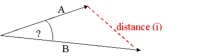


```csharp
public static double Distance(Vector v1, Vector v2)
{
   return
   (
      Math.Sqrt
      (
          (v1.X - v2.X) * (v1.X - v2.X) +
          (v1.Y - v2.Y) * (v1.Y - v2.Y) +
          (v1.Z - v2.Z) * (v1.Z - v2.Z)
      )
   );
}

public double Distance(Vector other)
{
   return Distance(this, other);
}
```

**Absolute**

This method finds the absolute value of a vector by applying the Abs
method to each of the component parts. This is not the same as
magnitude.

```csharp
public static Vector Abs(Vector v1)
{
   return
   (
      new Vector
      (
         Math.Abs(v1.X),
         Math.Abs(v1.Y),
         Math.Abs(v1.Z)
      )
   );
}

public Vector Abs()
{
   return Abs(this);
}
```

**Angle**

This method finds the angle between two vectors using normalization and
dot product.

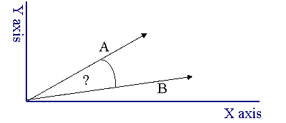


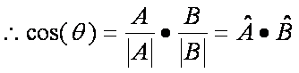


^ refers to a normalized (unit) vector.

\|\| refers to the magnitude of a Vector.

```csharp
public static double Angle(Vector v1, Vector v2)
{
   return
   (
      Math.Acos
      (
         Normalize(v1).DotProduct(Normalize(v2))
      )
   );
}

public double Angle(Vector other)
{
   return Angle(this, other);
}
```

**Max and Min**

These methods compare the magnitude of two vectors and return the vector
with the largest or smallest magnitude respectively.

```csharp
public static Vector Max(Vector v1, Vector v2)
{
   if (v1 >= v2){return v1;}
   return v2;
}

public Vector Max(Vector other)
{
   return Max(this, other);
}

public static Vector Min(Vector v1, Vector v2)
{
   if (v1 <= v2){return v1;}
   return v2;
}

public Vector Min(Vector other)
{
   return Min(this, other);
}
```

**Yaw**

This method rotates a vector around the Y axis by a given number of
degrees (Euler rotation around Y).


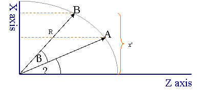


The hypotenuse (R) cancels out in the equation.

```csharp
public static Vector Yaw(Vector v1, double degree)
{
   double x = ( v1.Z * Math.Sin(degree) ) + ( v1.X * Math.Cos(degree) );
   double y = v1.Y;
   double z = ( v1.Z * Math.Cos(degree) ) - ( v1.X * Math.Sin(degree) );
   return new Vector(x, y, z);
}

public void Yaw(double degree)
{
   this = Yaw(this, degree);
}
```

This method directly affects the instance from which the method was
called.

**Pitch**

This method rotates a vector around the X axis by a given number of
degrees (Euler rotation around X).

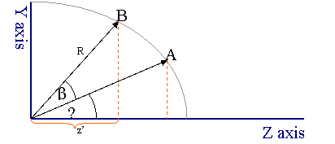

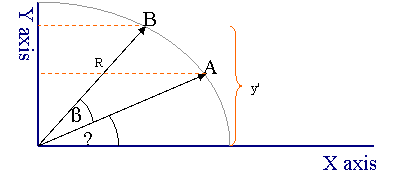


The hypotenuse (R) cancels out in the equation.

```csharp
public static Vector Pitch(Vector v1, double degree)
{
   double x = v1.X;
   double y = ( v1.Y * Math.Cos(degree) ) - ( v1.Z * Math.Sin(degree) );
   double z = ( v1.Y * Math.Sin(degree) ) + ( v1.Z * Math.Cos(degree) );
   return new Vector(x, y, z);
}

public void Pitch(double degree)
{
   this = Pitch(this, degree);
}
```

This method directly affects the instance from which the method was
called.

**Roll**

This method rotates a vector around the Z axis by a given number of
degrees (Euler rotation around Z).

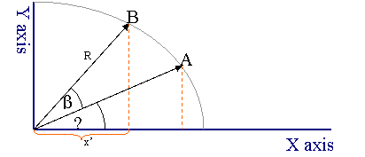


The hypotenuse (R) cancels out in the equation.

```csharp
public static Vector Roll(Vector v1, double degree)
{
   double x = ( v1.X * Math.Cos(degree) ) - ( v1.Y * Math.Sin(degree) );
   double y = ( v1.X * Math.Sin(degree) ) + ( v1.Y * Math.Cos(degree) );
   double z = v1.Z;
   return new Vector(x, y, z);
}

public void Roll(double degree)
{
   this = Roll(this, degree);
}
```

This method directly affects the instance from which the method was
called.

**Back-face**

This method interprets a vector as a face normal and determines whether
the normal represents a back facing plane given a line-of-sight vector.
A back facing plane will be invisible in a rendered scene and as such
can be except from many scene calculations.

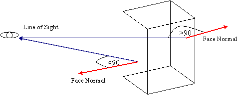


If  then if


If  then if


```csharp
public static bool IsBackFace(Vector normal, Vector lineOfSight)
{
   return normal.DotProduct(lineOfSight) < 0;
}

public bool IsBackFace(Vector lineOfSight)
{
   return IsBackFace(this, lineOfSight);
}
```

**Perpendicular**

This method checks if two vectors are perpendicular (i.e. if one vector
is the normal of the other).

```csharp
public static bool IsPerpendicular(Vector v1, Vector v2)
{
  return v1.DotProduct(v2) == 0;
}

public bool IsPerpendicular(Vector other)
{
   return IsPerpendicular(this, other);
}
```

**Sum components**

This method simply adds together the vector components (x, y, z).

```csharp
public static double SumComponents(Vector v1)
{
   return (v1.X + v1.Y + v1.Z);
}

public double SumComponents()
{
   return SumComponents(this);
}
```

**To Power**

This method multiplies the vectors components to a given power.

```csharp
public static Vector Pow(Vector v1, double power)
{
   return
   (
      new Vector
      (
         Math.Pow(v1.X, power),
         Math.Pow(v1.Y, power),
         Math.Pow(v1.Z, power)
      )
   );
}

public void Pow(double power)
{
   this = Pow(this, power);
}
```

**Square root**

This method applies the square root function to each of the vectors
components.

```csharp
public static Vector Sqrt(Vector v1)
{
   return
   (
      new Vector
      (
         Math.Sqrt(v1.X),
         Math.Sqrt(v1.Y),
         Math.Sqrt(v1.Z)
      )
   );
}

public void Sqrt()
{
this = Sqrt(this);
}
```

## Usability functions

For completeness a number of standardised methods have been added
complete the type.

To get a textual description of the type:

```csharp
public override string ToString()
{
   string output = null;

   if (IsUnitVector()){output += UNIT_VECTOR;}
   else {output += POSITIONAL_VECTOR;}

   output += string.Format( "( x={0}, y={1}, z={2} )", X, Y, Z );
   output += MAGNITUDE + Magnitude();

   return output;
}

private const string UNIT_VECTOR = "Unit vector composing of ";
private const string POSITIONAL_VECTOR = "Positional vector composing of ";
private const string MAGNITUDE = " of magnitude ";
```

To produce a hashcode for system use (required in order to implement
comparator operations (i.e. ==, !=)):

```csharp
public override int GetHashCode()
{
   return
   (
      (int)((X + Y + Z) % Int32.MaxValue)
   );
}
```

Check for equality (standardised version of == operatator):

```csharp
public override bool Equals(object other)
{
   // Check object other is a Vector object
   if(other is Vector)
   {
      // Convert object to Vector
      Vector otherVector = (Vector)other;
      // Check for equality
      return otherVector == this;
   }
   else
   {
      return false;
   }
}
```

Comparison method for two vectors which returns:

- -1 if the magnitude is less than the others magnitude
- 0 if the magnitude equals the magnitude of the other
- 1 if the magnitude is greater than the magnitude of the other

This allows the `Vector` type to implement the `IComparable` interface.

```csharp
Public int CompareTo(object other)
{
   if(other is Vector)
   {
      Vector otherVector = (Vector)other;

      if( this < otherVector ) { return -1; }
      else if( this > otherVector ) { return 1; }

      return 0;
   }
   else
   {
      // Error condition: other is not a Vector object
      throw new ArgumentException
      (
         // Error message includes information about the actual type of the argument
         NON_VECTOR_COMPARISON + "\n" + ARGUMENT_TYPE + other.GetType().ToString(),
         "other"
      );
   }
}

private const string NON_VECTOR_COMPARISON = "Cannot compare a Vector to a non-Vector";
private const string ARGUMENT_TYPE = "The argument provided is a type of ";
```

**Standard Cartesian vectors**

Finaly four standard vector constants are defined:

```csharp
public static readonly Vector origin = new Vector(0,0,0);
public static readonly Vector xAxis = new Vector(1,0,0);
public static readonly Vector yAxis = new Vector(0,1,0);
public static readonly Vector zAxis = new Vector(0,0,1);
```

## Additional operations

Beyond the original article, the type has grown a handful of operations that round it out for
modern, everyday use. Each one is also available to play with in the interactive
[visualizer](RP.Math.Vector3.Visualizer) — drag the vectors and watch the result update live.

### Reflect about a normal

Reflects a vector about the surface described by a **normal** — the classic "bounce" used for rays,
velocities and light. Note this is different from `Reflection`, which mirrors a vector about the
**line** of another vector.

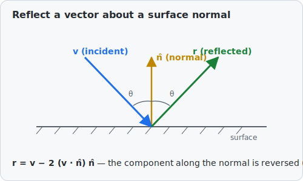

The component of `v` along the (unit) normal is reversed, so the angle of incidence equals the angle
of reflection:

```csharp
var incoming = new Vector3(1, -1, 0);
var surfaceNormal = new Vector3(0, 1, 0);
var bounced = incoming.Reflect(surfaceNormal);   // (1, 1, 0)
```

### Slerp — spherical interpolation

Where `Interpolate` (linear) walks the straight **chord** between two vectors, `Slerp` walks the
**arc** at a constant angular speed, so interpolated directions stay on the sphere. It falls back to
linear interpolation when the vectors are (anti)parallel.

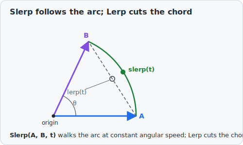

```csharp
var a = Vector3.XAxis;             // (1, 0, 0)
var b = Vector3.YAxis;             // (0, 1, 0)
var halfway = a.Slerp(b, 0.5);     // ~ (0.707, 0.707, 0) — still length 1
```

### Clamp magnitude

Caps a vector's length at a maximum while keeping its direction (a no-op when it is already short
enough) — handy for limiting speeds and forces.

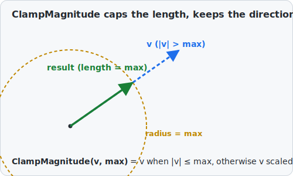

```csharp
var velocity = new Vector3(3, 4, 0);          // length 5
var limited = velocity.ClampMagnitude(2.5);   // (1.5, 2, 0), length 2.5
```

### Move towards

Steps from one point towards a target by at most a given distance, never overshooting — the staple
of frame-by-frame animation and AI movement.

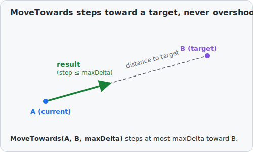

```csharp
var position = new Vector3(0, 0, 0);
var target = new Vector3(10, 0, 0);
var next = position.MoveTowards(target, 3);   // (3, 0, 0)
```

### Component-wise Min, Max and Clamp

These work on **each axis independently** — the X of the result depends only on the Xs of the
inputs, the Y only on the Ys, and the Z only on the Zs.

`ComponentMin` takes the smaller value on every axis and `ComponentMax` the larger, so together they
give the two opposite corners of the **axis-aligned bounding box** that just contains the two input
points:

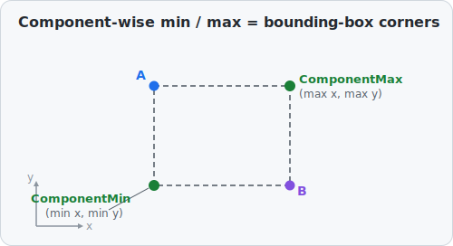

```csharp
var lo = new Vector3(1, 5, 3).ComponentMin(new Vector3(4, 2, 6)); // (1, 2, 3) — smaller of each axis
var hi = new Vector3(1, 5, 3).ComponentMax(new Vector3(4, 2, 6)); // (4, 5, 6) — larger of each axis
```

> **Not the same as `Min` / `Max`.** Those compare whole vectors by *magnitude* (length) and return
> the shorter or longer one unchanged — they never mix components. Use `ComponentMin` / `ComponentMax`
> when you want a per-axis result.

`Clamp` is the same idea applied to a range: it pushes each component of a vector into the
`[min, max]` interval for that axis.

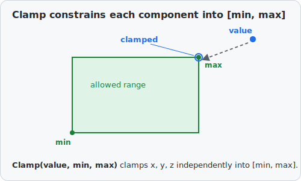

```csharp
var inBox = new Vector3(5, -5, 2).Clamp(Vector3.Origin, new Vector3(3, 3, 3)); // (3, 0, 2)
```

### Cheaper comparisons: `DistanceSquared` and `MagnitudeSquared`

When you only need to **compare** lengths or distances, skip the square root:

```csharp
double d2 = Vector3.DistanceSquared(a, b);   // |a − b|², no Math.Sqrt
double m2 = velocity.MagnitudeSquared;        // |velocity|²
```

### Zero test

```csharp
bool isZero = vector.IsZero();        // exactly (0, 0, 0)
bool nearZero = vector.IsZero(1e-6);  // magnitude within a tolerance of zero
```

### Deconstruction and tuple conversion

The type deconstructs into its components and converts implicitly to and from a `(double, double,
double)` tuple:

```csharp
var (x, y, z) = velocity;                 // deconstruction
Vector3 v = (1.0, 2.0, 3.0);              // from a tuple
(double X, double Y, double Z) t = v;     // to a tuple
```

## Summary

We now have a `Vector` type with the following functionality:

- Constructors
  - `Vector(double x, double y, double z)`
  - `Vector(double[] xyz)`
  - `Vector(Vector v1)`

<!-- -->

- Properties
  - `X`
  - `Y`
  - `Z`

<!-- -->

- Operators
  - Indexer
  - `+`
  - `-`
  - `==`
  - `!=`
  - `*`
  - `/`
  - `<`
  - `>`
  - `<=`
  - `>=`

<!-- -->

- Static methods
  - `CrossProduct`
  - `DotProduct`
  - `Magnitude`
  - `Normalize`
  - `IsUnitVector`
  - `Interpolate`
  - `Distance`
  - `Abs`
  - `Angle`
  - `Max`
  - `Min`
  - `Yaw`
  - `Pitch`
  - `Roll`
  - `IsBackFace`
  - `IsPerpendicular`
  - `SumComponents`
  - `Sqrt`
  - `Pow`

<!-- -->

- Instance methods which directly affect the instance variables
  - `Magnitude`
  - `Normalize`
  - `Yaw`
  - `Pitch`
  - `Roll`
  - `Sqrt`
  - `Pow`

<!-- -->

- Instance methods which return a new object or type
  - `CrossProduct`
  - `DotProduct`
  - `IsUnitVector`
  - `Interpolate`
  - `Distance`
  - `Abs`
  - `Angle`
  - `Max`
  - `Min`
  - `IsBackFace`
  - `IsPerpendicular`
  - `SumComponents`
  - `CompareTo`
  - `Equals`
  - `ToString`
  - `GetHashCode`

## Points of Interest

There were a number of resources I used during the development of this
article and source code provided, I would like to acknowledge the
following:

- [CSOpenGL](http://sourceforge.net/projects/csopengl/) Project - Lucas
  Viñas Livschitz
- [Exocortex](http://www.exocortex.org/) Project - Ben Houston
- Essential Mathematics for Computer Graphics - John Vince (ISBN
  1-85233-380-4)

## History

Done:

- Method to reflect a `Vector` about a given normal — implemented as `Reflect(normal)`
  (distinct from `Reflection`, which mirrors about a vector's line).
- Added for completeness: `ComponentMin`/`ComponentMax`, `Clamp`, `DistanceSquared`,
  `ClampMagnitude`, `MoveTowards`, `Slerp`, `MagnitudeSquared`, `IsZero`, tuple
  deconstruction/conversion, and an interactive Blazor WebAssembly visualizer.
